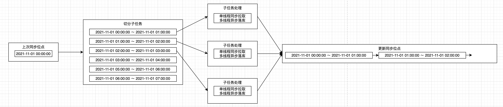

# 数据同步——实现篇

## 方案设计

针对时间范围类型的分页接口数据同步，需要持续追踪同步位点：已经同步的时间范围、分页参数，保证数据同步**准确**。

为了数据**及时**性，往往需要使用多线程增大请求和落库并发，提高同步速度。

### 数据同步

* 同步位点。同步位点记录同步进度，包括已同步的时间，分页参数。同步程序存在系统重启发布、崩溃等场景，需要在外部存储系统中记录同步位点。当同步任务执行结束时持久化同步位点到外部存储系统中，同步任务开始时读取同步位点。
* 任务并发。在某一个时间范围内，数据拉取只能单线程顺序拉取，拉取速度取决于开放平台接口性能。但是可以同时拉取多个时间范围，加大拉取速度。
* 数据落库。数据拉取只能单线程拉取，拉取后的落库可以多线程异步落库，但是需确保所有的数据都会最终落库。
* 任务失败。最常见的失败形式有两种：网络失败，限流。调用开放平台接口需要走公网，网络环境质量和内网环境完全不同，接口超时、数据丢包非常常见，因此需要增加重试功能以应对网络失败和限流，尽量避免任务失败进入异常处理流程。
* 主动限流。过高的请求如果大部分被开放平台限流，意义并不大。过多的请求反而会造成不好的影响，比如大量的请求失败日志，频繁的任务失败，主动限流可以有效增加数据同步体验。

### 同步流程



* 任务启动。读取外部存储中同步位点，作为同步的起点。
* 切分子任务。根据需要确定每个时间段的间隔，需要切分出多少个子任务。
* 多线程处理子任务。每个子任务处理时采用单线程同步拉取，多线程异步落库，当数据全部落库时子任务结束。
* 子任务结束后，按照子任务切分时的顺序依次更新同步位点。注意切分的子任务是多线程乱序处理的，子任务处理完成后更新同步位点是严格按照子任务的顺序依次更新。因此排在后面的子任务先完成，需等待它之前的所有任务完成后才能更新完同步位点。
* 异常处理。通过限流和重试减少网络问题和限流造成的失败影响后，依然发生的异常会直接终止此次任务，而进行中子任务无论成功或失败都不再更新同步位点。

## 调度系统

通过接口同步数据需要调度系统提供秒级调度支持，不停地去推进分页，推进时间实时地接入数据。

调度系统分为两类：DAG 调度系统，非 DAG 调度系统。

DAG 调度系统如 airflow、azkaban、dolphinscheduler 等，以支持大数据任务依赖为主，对于秒级任务调度能力有限，只能小规模地运行秒级任务调度。

非 DAG 调度系统如 xxl-job、elastic-job 等。

## 方案实现

数据同步的代码实现分为 2 部分：同步框架 + 同步业务。

数据同步流程中存在单线程转多线程在转单线程，还要保证转回单线程时有序，实现它需要深厚的并发功底，这部分也是与业务无关的同步框架，可多次复用。

同步位点的存取，查询开放平台接口，持久化同步的数据则归类到同步业务中，以处理各种形式不一的开放平台数据接口。

### 同步业务

业务接口定义如下：

```java
public interface JobProcessor<RootTask, SubTask, Result> {

    List<SubTask> map(RootTask rootTask);

    CompletableFuture<Pair<Result, Long>> process(Pair<SubTask, Long> subTaskPair);

    Result reduce(Result result);

}
```

* `#map(RootTask)`。map 接口实现任务切分。
* `#process(Pair<SubTask, Long>)`。process 接口实现子任务处理。
  * `pair.second` 为子任务编号，以支持后续的多线程转单线程时，对子任务进行排序，有序更新同步位点。
  * 返回结果为 `CompletableFuture`，支持多线程持久化数据时无需阻塞线程，等待全部数据处理完毕。
* `#reduce(Result)`。reduce 接口实现每个子任务处理完毕后，更新同步位点。

### 同步框架

同步框架在经过多轮迭代后，历经线程池、并发队列、CompletableFuture 等，使用 `akka streams` 库得到了下面如丝般顺滑的同步代码。

```java
JobProcessor<RootSyncJob, SubSyncJob, ProcessResult> processor = null;

Source<SubSyncJob, UniqueKillSwitch> source = Source.single(new RootSyncJob())
        .mapConcat(processor::map)
        .viaMat(KillSwitches.single(), Keep.right());

Flow<Pair<SubSyncJob, Long>, Pair<ProcessResult, Long>, NotUsed> process = Flow.<Pair<SubSyncJob, Long>>create()
        .map(processor::process).mapAsync(1, future -> future);

Flow<Pair<SubSyncJob, Long>, Pair<ProcessResult, Long>, NotUsed> subTasks =
        Flow.fromGraph(
                GraphDSL.create(
                        b -> {
                            int concurrency = 10;
                            UniformFanOutShape<Pair<SubSyncJob, Long>, Pair<SubSyncJob, Long>> partition =
                                    b.add(Partition.create(concurrency, subTask -> Math.toIntExact(subTask.second()) % concurrency));
                            UniformFanInShape<Pair<ProcessResult, Long>, Pair<ProcessResult, Long>> merge =
                                    b.add(MergeSequence.create(concurrency, Pair::second));

                            for (int i = 0; i < concurrency; i++) {
                                b.from(partition.out(i))
                                        .via(b.add(process.async()))
                                        .viaFanIn(merge);
                            }

                            return FlowShape.of(partition.in(), merge.out());
                        }));

Pair<UniqueKillSwitch, CompletionStage<Done>> pair = source.zipWithIndex().via(subTasks.map(Pair::first))
        .log("stream logginng")
        .withAttributes(
                Attributes.createLogLevels(
                        Logging.DebugLevel(), // onElement
                        Logging.DebugLevel(), // onFinish
                        Logging.ErrorLevel()  //onFailure
                )
        )
        .recover(new PFBuilder<Throwable, ProcessResult>()
                .match(Throwable.class, throwable -> ProcessResult.failure(throwable))
                .build())
        .toMat(Sink.foreach(result -> processor.reduce(result)), Keep.both())
        .run(actorSystem);

UniqueKillSwitch killSwitch = pair.first();
//        TimeUnit.SECONDS.sleep(5L);
//        killSwitch.shutdown();

CompletionStage<Done> future = pair.second();
// future.whenComplete((done, throwable) -> {
//     if (throwable != null) {
//         log.error("执行异常!", throwable);
//     } else {
//         log.debug("执行结束!");
//     }
// });
```

* 流式处理。同步框架采用流式实现，完全无阻塞，支持背压，流程清晰可读。
* 异常处理。
  * 日志打印。流中发生异常会使用 `error` 级别输出到日志中。
  * 异常恢复。流中发生异常时将异常封装为 `ProcessResult`，并立即终止流。
* 任务关闭。增加了任务关闭开关：`UniqueKillSwitch`。在服务器发布期间，需关闭应用。流处理期间会阻止程序的自然关闭，直到关闭超时被强制杀死。又或者在调度任务关闭，手动停止任务执行场景，都面临着关闭流的需求。借助 `UniqueKillSwitch` 可以直接终止流。
* 任务执行结果。
* 缺点在于同步框架只适合单机。
