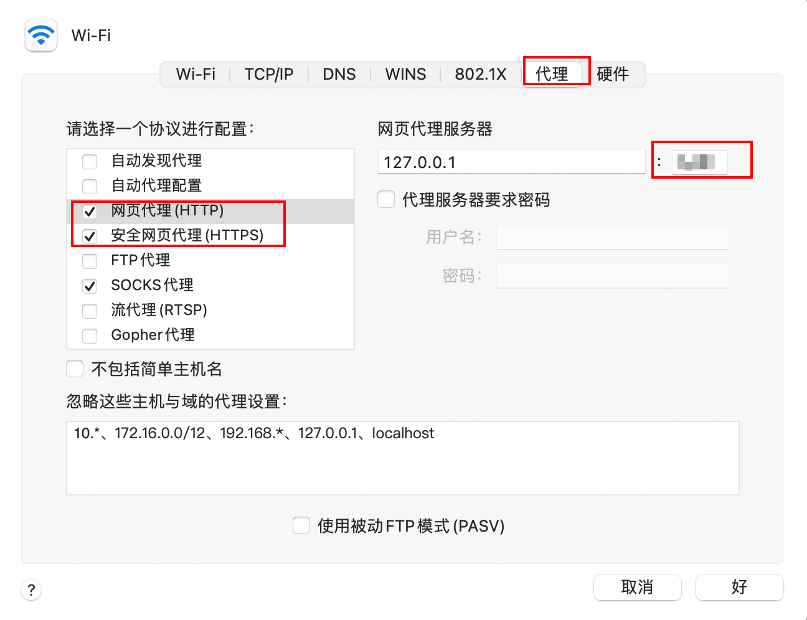

# Github

访问 github 时经常遇到网络不稳定的情况，导致浏览和 clone 代码经常失败，可以通过开启加速器和代理进行加速。

* 加速器。又名 VPN、科学上网工具。
* 代理。在开启加速器时，clone、pull、push 代码通过加速器端口加速。

## 网页访问

开启加速器即可

## git 访问

查看加速器在本地电脑的代理端口，不同的加速器产品有不同的端口号，需确认具体用了哪一个端口。

macOS 查看代理端口号方式：



获取到端口号后，代理地址即为：

```
http://127.0.0.1:$PORT
https://127.0.0.1:$PORT
```

配置全局代理：

```shell
# 设置代理
git config --global http.proxy http://127.0.0.1:$PORT
git config --global https.proxy https://127.0.0.1:$PORT

# 取消代理
git config --global --unset http.proxy
git config --global --unset https.proxy
```

提示：

* 开启全局代理后，git 和 github 服务器的网络都会通过加速器代理转发，未开启加速器情况下操作会失败
* 只支持 http 和 https 协议。如从 github 上 clone 代码时，使用 `git@github.com:xxx/yyy.git` 协议不支持
