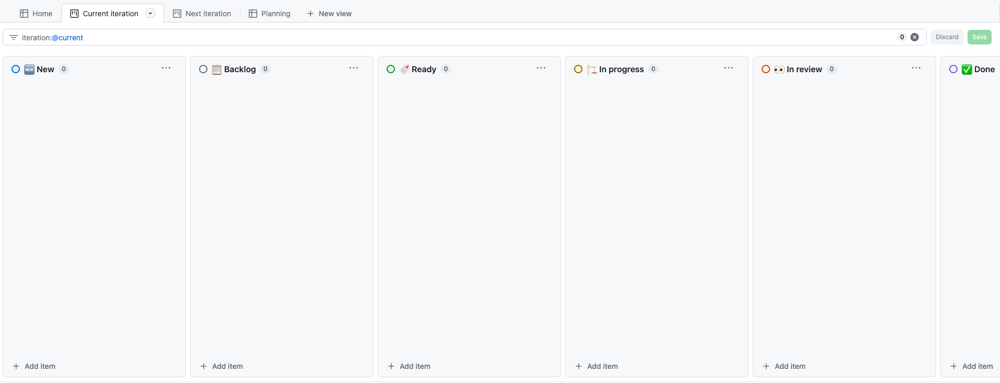
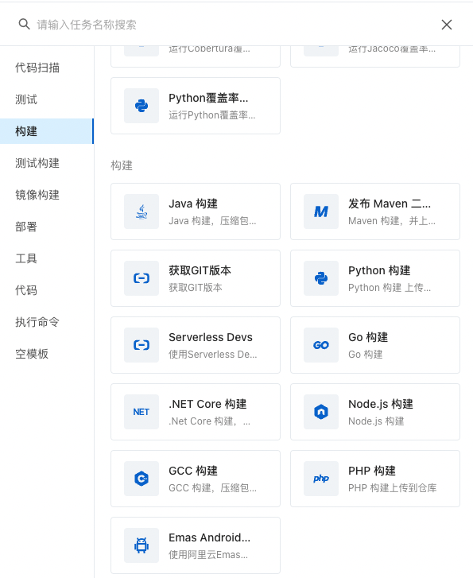

# 设计

### 任务结构

* dag
  * workflow
  * pipeline

任务一般都是 dag，大致上分为 2 类：workflow 和 pipeline。

对于 CI/CD 系统来说，还有些阶段性划分，比如 github 上的项目管理，阿里云云效的流水线：

它们会先执行**串行**的 `stage`，每个`stage`内的`task`组成一个`dag`

### 任务管理

* 启动
* 停止
* 暂停
* 恢复

### 任务触发

* 回调
* 用户触发

### 子任务串联

* 队列+事件监听
* EventBus

### 状态流转

* 状态机

 