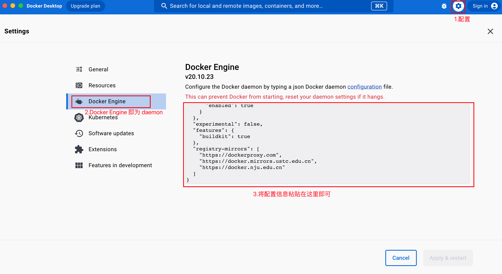

# Docker

配置方式介绍：

* 加速器。又名 VPN、科学上网工具。
  * 通过配置 docker 在本地电脑的流量转发接口，使用加速器更快下载 docker 镜像
  * 加速效果取决于本地网络和加速器，对所有镜像源有效。对于国内镜像源，如阿里云反而会因为多走了层加速器，下载速度偏慢
* 镜像代理。
  * 修改 docker 的 `daemon.json` 文件，添加镜像代理
  * 是否加速取决于镜像代理是否支持镜像源，比如镜像代理支持 docker hub、github、GCR，那么当下载镜像的位于 3 个源时可以起到代理效果，如果镜像在 K8S，则无法加速

## 加速器

查看加速器在本地电脑的代理端口，不同的加速器产品有不同的端口号，需确认具体用了哪一个端口。

macOS 查看代理端口号方式：


获取到端口号后，代理地址即为：

```
http://127.0.0.1:$PORT
```

配置 docker desktop 代理：


## 镜像代理

文档链接：

* [Docker Hub 镜像加速器](https://gist.github.com/y0ngb1n/7e8f16af3242c7815e7ca2f0833d3ea6)
* [docker proxy](https://dockerproxy.com/docs)。`https://dockerproxy.com` 代理介绍
* [docker daemon cli](https://docs.docker.com/engine/reference/commandline/dockerd/)

添加如下代理信息至 `daemon.json` 中。代理不定时失效，需勤快更新

```json
{
    "registry-mirrors": [
        "https://docker.m.daocloud.io",
        "https://docker.gh-proxy.com/"
    ]
}
```

docker desktop 配置如下：



查看配置更改是否成功：

```
# 命令行执行：docker info
# 输出如下信息即配置成功

Registry Mirrors:
 [...]
 https://dockerproxy.com
 https://docker.mirrors.ustc.edu.cn
 https://docker.nju.edu.cn
```

如果是 linux 环境，可以直接编辑 `daemon.json` 文件，没有则新建：

```shell
vim /etc/docker/daemon.json

## 在将代理镜像仓库地址，添加到 `daemon.json` 即可

## 添加完毕后，重启 docker
systemctl restart docker
systemctl status docker

## 查看配置是否成功
docker info
```

