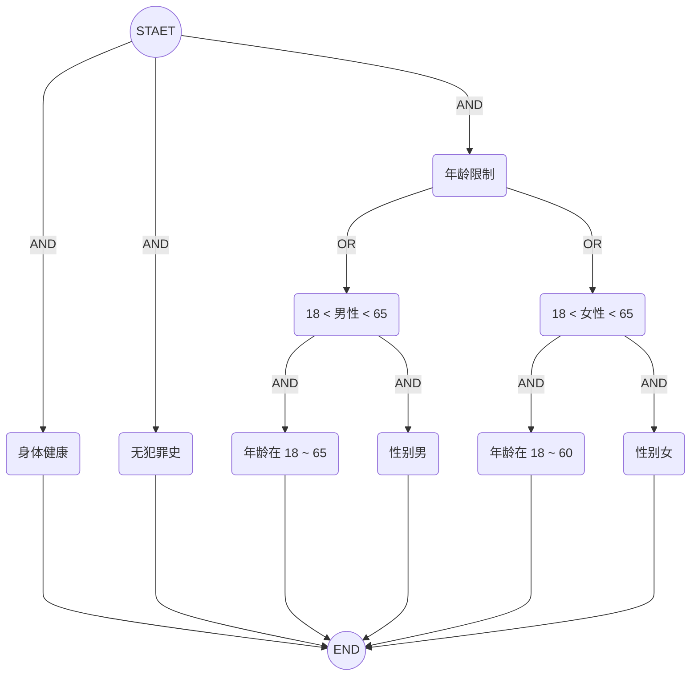

# 概念


如上图所示，假设我们对模式 `A、B、B、C` 感兴趣，它代表我们想要找到这样的事件序列：

* A 类事件发生
* B 类事件发生两次
* C 类事件发生

从事件流中匹配出 `a1、b1、b2、c1` 的具体事件。注意，这里我们并不要求事件之间是严格连续的

flink-cep 分为 3 个核心概念：

* 模式（`Pattern`）
* 事件流（`DataStream<Event>`）
* 匹配结果（`Match`）

flink-cep 的应用场景有：

* 实时风控。
  * 风险用户检测。5 分钟内转账次数超过 10 次且金额大于 10000
* 实时营销。滴滴的一些实时营销场景：
  * 乘客线上冒泡 1 分钟没罚单
  * 乘客下单后 2 分钟内没司机接单
  * 乘客在不同业务线之间比价
* 实时规则检测。
  * 直播实时检测。检测到 10 分钟内观看人数持续下跌，实时推送直播达人，调整直播策略
  * 用户在 30 分钟内创建多笔订单，没有支付，疑似刷单，进行账号封禁
  * 爆品发现。某款商品 5 分钟内成交超过 1000 单，实时推送商家，提醒及时补货、直播见挂链接
  * 在线奖励。当完成在线任务后，及时发放积分和奖励

## 1.模式

### 1.1 条件

可以指定一个条件来决定事件是否进入这个模式，条件可以很简单，比如 `value > 5` 或 `name contains "SB"`等

#### 1.1.1 组合条件树

条件可以是很复杂的，由多个条件组合、具有层级的筛选规则组成。组合条件树需包含 2 个概念：

* 可组合。可通过`且或`条件进行组合
* 可分层。条件不只是简单的 `value > 5` 还可以史复合条件如 `18 < age < 60 and sex == "man"`

比如想捞取身体健康、无犯罪史、女性年龄在 18 ～ 60 或男性在 18 ~ 65 岁之间的用户：



可用 JSON 表达如下：

```json
{
    "type": "and",
    "expressions": [
        {
            "type": "single",
            "detail": {
                "fieldName": "health",
                "fieldType": "enum",
                "operation": "==",
                "values": [
                    "good"
                ]
            }
        },
        {
            "type": "single",
            "detail": {
                "fieldName": "criminal",
                "fieldType": "enum",
                "operation": "==",
                "values": [
                    "none"
                ]
            }
        },
        {
            "type": "composite",
            "detail": {
                "type": "or",
                "expressions": [
                    {
                        "type": "composite",
                        "detail": {
                            "type": "and",
                            "expressions": [
                                {
                                    "type": "single",
                                    "detail": {
                                        "fieldName": "age",
                                        "fieldType": "number",
                                        "operation": "range",
                                        "values": [
                                            18,
                                            60
                                        ]
                                    }
                                },
                                {
                                    "type": "single",
                                    "detail": {
                                        "fieldName": "sex",
                                        "fieldType": "enum",
                                        "operation": "==",
                                        "values": [
                                            "woman"
                                        ]
                                    }
                                }
                            ]
                        }
                    },
                    {
                        "type": "composite",
                        "detail": {
                            "type": "and",
                            "expressions": [
                                {
                                    "type": "single",
                                    "detail": {
                                        "fieldName": "age",
                                        "fieldType": "number",
                                        "operation": "range",
                                        "values": [
                                            18,
                                            65
                                        ]
                                    }
                                },
                                {
                                    "type": "single",
                                    "detail": {
                                        "fieldName": "sex",
                                        "fieldType": "enum",
                                        "operation": "==",
                                        "values": [
                                            "man"
                                        ]
                                    }
                                }
                            ]
                        }
                    }
                ]
            }
        }
    ]
}
```

#### 1.1.2 迭代条件

条件不只在单个事件，还可以扩展到多个事件，比如某日销售额超过前 3 天的平均值 20%，数据流为每日销售额对象。

```json
[
    {
        "date": "20251011",
        "gmv": 100
    },
    {
        "date": "20251012",
        "gmv": 200
    },
    {
        "date": "20251013",
        "gmv": 150
    },
    {
        "date": "20251014",
        "gmv": 600
    }
]
```

针对上面数据，判断 `20251014` 销售额是否超过 `20251011 + 20251012 + 20251013` 平均值 20%。

又或者第一次报警发生后，30s 内发生第二次报警，进行报警升级，第一次报警邮件通知，第二次升级为电话通知。

### 1.2 量词


### 1.3 模式


### 连续性

在模式序列中，多个匹配

* **严格连续**: 期望所有匹配的事件严格的一个接一个出现，中间没有任何不匹配的事件。
* **松散连续**: 忽略匹配的事件之间的不匹配的事件。
* **不确定的松散连续**: 更进一步的松散连续，允许忽略掉一些匹配事件的附加匹配。


### 匹配后跳过策略

## 限制

* 不可逆。
