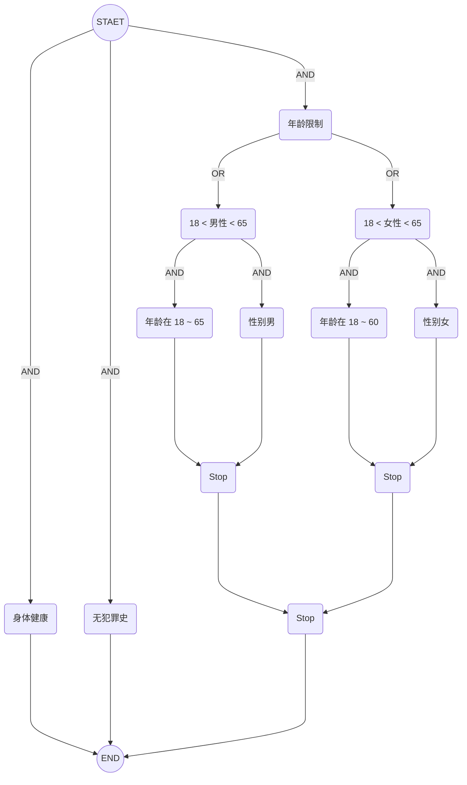
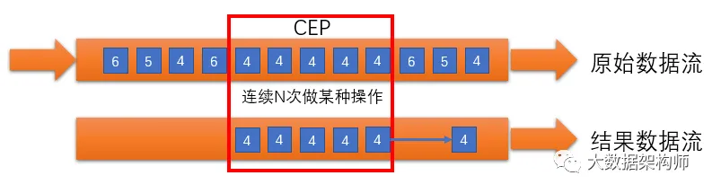
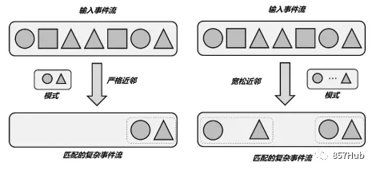

# 概念


如上图所示，假设我们对模式 `A、B、B、C` 感兴趣，它代表我们想要找到这样的事件序列：

* A 类事件发生
* B 类事件发生两次
* C 类事件发生

从事件流中匹配出 `a1、b1、b2、c1` 的具体事件。注意，这里我们并不要求事件之间是严格连续的

flink-cep 分为 3 个核心概念：

* 模式（`Pattern`）
* 事件流（`DataStream<Event>`）
* 匹配结果（`Match`）

flink-cep 的应用场景有：

* 实时风控。
  * 风险用户检测。5 分钟内转账次数超过 10 次且金额大于 10000
* 实时营销。滴滴的一些实时营销场景：
  * 乘客线上冒泡 1 分钟没罚单
  * 乘客下单后 2 分钟内没司机接单
  * 乘客在不同业务线之间比价
* 实时规则检测。
  * 直播实时检测。检测到 10 分钟内观看人数持续下跌，实时推送直播达人，调整直播策略
  * 用户在 30 分钟内创建多笔订单，没有支付，疑似刷单，进行账号封禁
  * 爆品发现。某款商品 5 分钟内成交超过 1000 单，实时推送商家，提醒及时补货、直播间挂链接
  * 在线奖励。当完成在线任务后，及时发放积分和奖励

## 1.模式

模式有 3 种：

* 单个模式
* 组合模式
* 模式组

### 1.1 单个模式

#### 1.1.1 条件（Conditions）

可以指定一个条件来决定事件是否进入这个模式：

* 条件可以很简单，比如 `value > 5` 或 `name contains "SB"`等
* 条件可以是很复杂的，由多个条件组合、具有层级的筛选规则组成，形成组合条件树

组合条件树需包含 2 个概念：

* 可组合。可通过`且或`条件进行组合
* 可分层。条件不只是简单的 `value > 5` 还可以是复合条件如 `18 < age < 60 and sex == "man"`

比如想捞取身体健康、无犯罪史、女性年龄在 18 ～ 60 或男性在 18 ~ 65 岁之间的用户：



可用 JSON 表达如下：

```json
{
    "type": "and",
    "expressions": [
        {
            "type": "single",
            "detail": {
                "fieldName": "health",
                "fieldType": "enum",
                "operation": "==",
                "values": [
                    "good"
                ]
            }
        },
        {
            "type": "single",
            "detail": {
                "fieldName": "criminal",
                "fieldType": "enum",
                "operation": "==",
                "values": [
                    "none"
                ]
            }
        },
        {
            "type": "composite",
            "detail": {
                "type": "or",
                "expressions": [
                    {
                        "type": "composite",
                        "detail": {
                            "type": "and",
                            "expressions": [
                                {
                                    "type": "single",
                                    "detail": {
                                        "fieldName": "age",
                                        "fieldType": "number",
                                        "operation": "range",
                                        "values": [
                                            18,
                                            60
                                        ]
                                    }
                                },
                                {
                                    "type": "single",
                                    "detail": {
                                        "fieldName": "sex",
                                        "fieldType": "enum",
                                        "operation": "==",
                                        "values": [
                                            "woman"
                                        ]
                                    }
                                }
                            ]
                        }
                    },
                    {
                        "type": "composite",
                        "detail": {
                            "type": "and",
                            "expressions": [
                                {
                                    "type": "single",
                                    "detail": {
                                        "fieldName": "age",
                                        "fieldType": "number",
                                        "operation": "range",
                                        "values": [
                                            18,
                                            65
                                        ]
                                    }
                                },
                                {
                                    "type": "single",
                                    "detail": {
                                        "fieldName": "sex",
                                        "fieldType": "enum",
                                        "operation": "==",
                                        "values": [
                                            "man"
                                        ]
                                    }
                                }
                            ]
                        }
                    }
                ]
            }
        }
    ]
}
```

#### 1.1.2 量词

如果只能检测到单个事件（虽然单个事件的匹配规则可能很复杂，但也只能匹配一个事件），会使用受限。flink-cep 也可以支持对模式增加`量词`，表达事件的重复次数。

模式类型：

* 单例模式。只能匹配一次
* 循环模式。可重复匹配



比如在金融风控场景，检测用户连续转账 5 次且每次转账金额大于 10000 的行为，暂时封禁用户账号，防止被诈骗。转账事件定义如下，金额单位：分

```json
{
    "timestamp": 1764315873504,
    "userId": "1",
    "amount": 1000000,
    "action": "transfer"
}
```

想检测到转账金额大于 10000，条件为 `action == "transfer" and amount >= 1000000`，接下来需要检测事件重复次数超过 5 次。5 次即为`量词`：

* 单例模式。`action == "transfer" and amount >= 1000000`
* 循环模式。设置 `action == "transfer" and amount >= 1000000` 重复次数超过 5 次

在 flink-cep 中实现如下：

```java
Pattern<Event, Event> pattern = Pattern.<Event>begin("转账事件")
        .where(new AviatorCondition<>("action == transfer and amount >= 1000000"))
        .timesOrMore(5); // 5 次或更多
```

flink-cep 支持的量词如下：

* `times(5)`。期望出现 5 次
* `times(1, 3)`。期望出现 1 ~ 3 次
* `timesOrMore(5)`。期望出现 5 次或更多
* `oneOrMore()`。等价于 `timesOrMore(1)`
* `opitonal()`。可将量词变成可选，加上`optional()` 表示可以不发生
  * `times(5).optional()`。表示可以出现 5 次，也可出现 0 次
  * `times(1, 3).optional()`。表示可以出现 1 ～ 3 次，也可以出现 0 次
  * `timesOrMore(5).optional()`。表示可以出现 5 次或更多，也可出现 0 次
* `greedy()`。期望尽可能多的重复，比如一个期望一个事件重复 3 次，实际上出现 10 次，匹配的时候期望把 10 次全拿出来作为一个结果，而不是把 10 次作为 3 + 3 + 3，给了 3 个结果。
  * `times(5).greedy()`。表示可以出现 5 次，并尽可能的重复次数多
  * `times(1, 3).greedy()`。表示可以出现 1 ～ 3 次，并尽可能的重复次数多
  * `timesOrMore(5).greedy()`。表示可以出现 5 次或更多，并尽可能的重复次数多
* `optinonal` 和 `greedy()` 也可以一起使用
  * `times(5).optional().greedy()`。表示可以出现 5 次，也可以出现 0 次，并尽可能的重复次数多

### 1.2 组合模式


比如在网站流量场景，通过埋点不断获取到用户在网页的曝光、点击、加购、下单、支付等事件，事件结构定义如下：

```json
{
    "timestamp": 1764315873504,
    "userId": "1",
    "productId": "1",
    "action": "view | click | addCart | order | pay"
}
```

想检测连续 3 次下单，但都没有支付的数据，向用户发送促销消息。需要匹配 2 个`单个模式`成为一个`组合模式`：

* 连续 3 次下单。单个模式，模式因为有`量词`从`单例`变成`循环`
* 支付。单个模式，无`量词`是`单例`

```java
// 单个模式。连续 3 次下单
Pattern<Event, Event> pattern = Pattern.<Event>begin("下单事件")
        .where(new AviatorCondition<>("action == order"))
        .timesOrMore(3);

// 单个模式。支付
Pattern<Event, Event> pattern = Pattern.<Event>begin("支付事件")
        .where(new AviatorCondition<>("action == pay"));

// 组合模式。连续 3 次下单 --没有---> 支付，连接条件：未发生
Pattern<Event, Event> pattern = Pattern.<Event>begin("下单事件")
        .where(new AviatorCondition<>("action == order"))
        .timesOrMore(3)
        .notFollowedBy("支付事件")
        .where(new AviatorCondition<>("action == pay"));
```

### 1.3 模式组

对于`模式组`是对`单个模式`和`组合模式`的更进一步结合，比如对检测连续 3 次下单，但都没有支付的数据，发生一次可能是用户没有购买意愿可向用户发送促销消息促成交，发生 10 次判断用户可能是刷单用户。因此需要检测模式整体发生了 10 次：

```java
// 组合模式
Pattern<Event, Event> notPayPattern = Pattern.<Event>begin("下单事件")
        .where(new AviatorCondition<>("action == order"))
        .timesOrMore(3)
        .notFollowedBy("支付事件")
        .where(new AviatorCondition<>("action == pay"));

// 模式组
Pattern<Event, Event> riskPattern = Pattern.begin(notPayPattern)
        .timesOrMore(10);
```

### 1.4 连续性

连续性指的是不同事件之间的是否连续，它有 2 个场景：

* 在`单个模式`中，如果对`单例`模式增加`量词`即可变成`循环`模式。比如检测用户连续转账 5 次且每次转账金额大于 10000 的行为，对于连续转账中的连续的定义：是真正的连续事件，还是转账事件中间可以夹杂着`登陆`、`登出`事件。
* 将多个`单个模式`组合成`组合模式`。比如连续 3 次下单，但没有支付的行为中，在连续 3 次下单和支付行为中间，是连续的，还是可以夹杂着`曝光`、`点击`、`加购`等事件。

在模式序列中，把多个`单个模式`组合成`组合模式`的条件为连续条件

* **严格连续**: 期望所有匹配的事件严格的一个接一个出现，中间没有任何不匹配的事件。
* **松散连续**: 两个匹配事件的相对顺序，忽略匹配的事件之间的不匹配的事件。
* **不确定的松散连续**: 可以重复使用之前已经匹配过的事件，以同一个事件作为开始匹配，更进一步的松散连续，允许忽略掉一些匹配事件的附加匹配。




配置方式：

* `组合模式`。
  * `next()`。严格连续
  * `followedBy()`。松散连续
  * `followedByAny()`。不确定的松散连续
* `模式组`。
  * `start.next(
        Pattern.<Event>begin("next_start").where(...).followedBy("next_middle").where(...)
    ).times(3)`
  * `start.followedBy(
        Pattern.<Event>begin("followedby_start").where(...).followedBy("followedby_middle").where(...)
    ).oneOrMore();`
  * `start.followedByAny(
        Pattern.<Event>begin("followedbyany_start").where(...).followedBy("followedbyany_middle").where(...)
    ).optional();`

同时还可以配置`Not`语义的连接：

* `notNext()`，如果不想后面直接连着一个特定事件
* `notFollowedBy()`，如果不想一个特定事件发生在两个事件之间的任何地方。

注意，`Not`语义有使用限制：

* 如果模式序列没有定义时间约束，则不能以 `notFollowedBy()` 结尾。
* 一个`Not`模式前面不能是可选的模式（有`optional()`量词）。

对于`单例`模式，通过增加`量词`变成`循环`模式时，重复次数的连续性配置如下：

* 严格连续。`consecutive() `与 `oneOrMore()` 和 `times()` 一起使用， 在匹配的事件之间施加严格的连续性， 也就是说，任何不匹配的事件都会终止匹配（和 `next()` 一样）。
* 松散连续。默认行为，即`followedBy()`
* 不确定性连续。`allowCombinations()` 与 `oneOrMore()` 和 `times()` 一起使用， 在匹配的事件中间施加不确定松散连续性（和 `followedByAny()` 一样）

### 1.5 时间约束

除了指定事件的重复次数和不同事件之间的组合，还可以添加时间约束：

* `循环`模式。比如 1 小时内检测用户连续转账 5 次且每次转账金额大于 10000 的行为
* `组合模式`。比如连续 3 次下单，但 10 分钟内没有支付的行为

### 1.6 复杂条件

单个事件的检测规则可以很简单，也可以很复杂，但是都是针对单个事件，条件也可以跨多个事件。

#### 1.6.1 案例1

比如某日销售额超过前 3 天的平均值 20%，数据流为每日销售额对象。

```json
[
    {
        "date": "20251011",
        "gmv": 100
    },
    {
        "date": "20251012",
        "gmv": 200
    },
    {
        "date": "20251013",
        "gmv": 150
    },
    {
        "date": "20251014",
        "gmv": 600
    }
]
```

针对上面数据，判断 `20251014` 销售额是否超过 `20251011 + 20251012 + 20251013` 平均值 20%。

这种场景下，需获取当日销售额的前 3 天销售额，计算前 3 天销售额的平均值，继而和当天销售额进行比较。

实现方式如下：

```java
Pattern<Event, Event> pattern = Pattern.<Event>begin("start", AfterMatchSkipStrategy.noSkip())
        .where(BooleanConditions.trueFunction())
        .times(3)
        .next("avg")
        .where(new IterativeCondition<Event>() {
            @Override
            public boolean filter(Event event, Context<Event> context) throws Exception {
                Iterable<Event> start = context.getEventsForPattern("start");
                Long sum = 0L;
                Long size = 0L;
                for (Event startEvent : start) {
                    sum += startEvent.getGmv();
                    size++;
                }
                Double avg = sum * 1.0 / size;
                double increase = (event.getGmv() - avg) * 1.0 / avg;
                System.out.println("start: " + JacksonUtil.toJsonString(start) + ", event: " + JacksonUtil.toJsonString(event));
                return increase > 0.2;
            }
        })
        .times(1);
```

因为是计算每日销售额是否大于前 3 天销售额，因此前 3 天的数据是一个滑动窗口效果。


todo：判断 context 是否可以获取正在匹配的模式的数据

```java
Pattern<Event, Event> pattern = Pattern.<Event>begin("gmv")
        .oneOrMore()
        .where(new IterativeCondition<Event>() {
            @Override
            public boolean filter(Event event, Context<Event> context) throws Exception {
                Iterable<Event> events = context.getEventsForPattern("gmv");
                List<Event> list = IteratorUtils.toList(events.iterator());
                if (CollectionUtils.size(list) < 3) {
                    return true;
                }
                if (CollectionUtils.size(list) == 3) {
                    Long avgAmount = calAvg(list);
                    return (event.getAmount() - avgAmount) / avgAmount >= 0.2;
                }
                return false;
            }
        })
        ;
```

todo: 如何实现滚动

```java
Pattern<Event, Event> pattern = Pattern.<Event>begin("gmv")
        .where(BooleanConditions.trueFunction())
        .times(3)
        .next("higherGmv")
        .where(new IterativeCondition<Event>() {
            @Override
            public boolean filter(Event event, Context<Event> context) throws Exception {
                Iterable<Event> events = context.getEventsForPattern("gmv");
                Long sumAmount = 0L;
                for (Event gmvEvent : events) {
                    sumAmount += gmvEvent.getAmount();
                }
                Long avgAmount = sumAmount / 3;
                return (event.getAmount() - avgAmount) / avgAmount >= 0.2;
            }
        })
        ;
```


#### 1.6.2 案例2

以监控告警为例：第一次告警发生后，30s 内发生第二次告警，进行告警升级，第一次告警邮件通知，第二次升级为电话通知。

需要配置  2 条规则：

```java
// 只能匹配到 第一次发生报警，在 30s 内发生第二次报警的组合事件。如果发生一次告警，没有在 30s 内发生第二次，告警就会被吞掉，无法进行邮件通知
Pattern<Event, Event> pattern = Pattern.<Event>begin("first alert") // 首次告警
        .where(new AviatorCondition<>("type == alert"))
        .times(1)
        .followedBy("second alert")                                 // 30s再次告警。如果增加 optional() 修饰，会导致告警到达不能第一时间处理，需要等待 30s 查看是否有第二条
        .where(new AviatorCondition<>("type == alert"))
        .within(Time.of(30, TimeUnit.SECONDS))
        ;
// 如果在增加一个模式，则先发生一次告警，30s内发生第二次告警，则两次告警都会被这个检测到，会发 2 次邮件通知，加上 1 次电话通知
Pattern<Event, Event> pattern = Pattern.<Event>begin("alert") // 告警
        .where(new AviatorCondition<>("type == alert"))
        ;
```

也可以配置 1 条规则：

* 通过把第二次告警事件的发生次数设置为 `optional()` 可保证只有一次告警的时候也能发出
* 因为设置了时间约束，30s 内，可通过超时函数获取到只发生一次告警的事件

缺点是在第一次告警发生后，需等待 30s 查看是否有第二条告警事件，导致第一次告警后不能及时发送告警通知

```java
// 只能匹配到 第一次发生报警，在 30s 内发生第二次报警的组合事件
Pattern<Event, Event> pattern = Pattern.<Event>begin("first alert") // 首次告警
        .where(new AviatorCondition<>("type == alert"))
        .times(1)
        .followedBy("second alert")                                 // 30s再次告警。如果增加 optional() 修饰，会导致告警到达不能第一时间处理，需要等待 30s 查看是否有第二条
        .where(new AviatorCondition<>("type == alert"))
        .optional()
        .within(Time.of(30, TimeUnit.SECONDS))
        ;
```

比较好的实现是把 30s 的时间间隔放置到发送告警消息时，如果只有 1 条消息，发送邮件通知，如果有 2 条消息，且 2 条消息的时间间隔低于 30 s，发送电话通知，否则发送邮件通知。

```java
// 只能匹配到 第一次发生报警，在 30s 内发生第二次报警的组合事件
Pattern<Event, Event> pattern = Pattern.<Event>begin("first alert") // 首次告警
        .where(new AviatorCondition<>("type == alert"))
        .times(1)
        .followedBy("second alert")                                 // 30s再次告警。如果增加 optional() 修饰，会导致告警到达不能第一时间处理，需要等待 30s 查看是否有第二条
        .where(new AviatorCondition<>("type == alert ")) // todo
        .optional()
        ;
```

todo

* 告警静默。1 小时内只发送一次

#### 1.6.3 案例3

多模式的匹配条件

## 2.匹配后跳过策略

xxxx

## 3.限制条件

* 不可逆。
* 有序。A -> B -> C，A -> C -> B，B -> A -> C，B -> C -> A，C -> A -> B，C -> B -> A
