# 监控告警

## 阿里云 Flink 实时计算平台

阿里云 Flink 实时计算平台的告警由阿里云 ARMS 实现。监控指标由 ARMS 的 prometheus 实例采集，任何告警规则都可以在 ARMS 配置。在 Flink 实时计算平台这边提供了一些预定义指标的方便配置，这些配置都可以在 ARMS 配置实现。

参考链接：[配置监控告警](https://help.aliyun.com/zh/flink/user-guide/configure-alert-rules?spm=a2cn1.deployment_alarm_rules.help.dexternal.a04f458a82ILXa)

### 告警模板

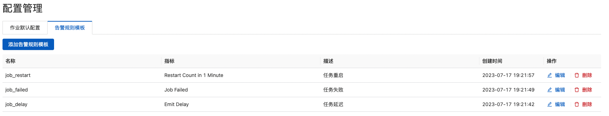

#### 告警详情

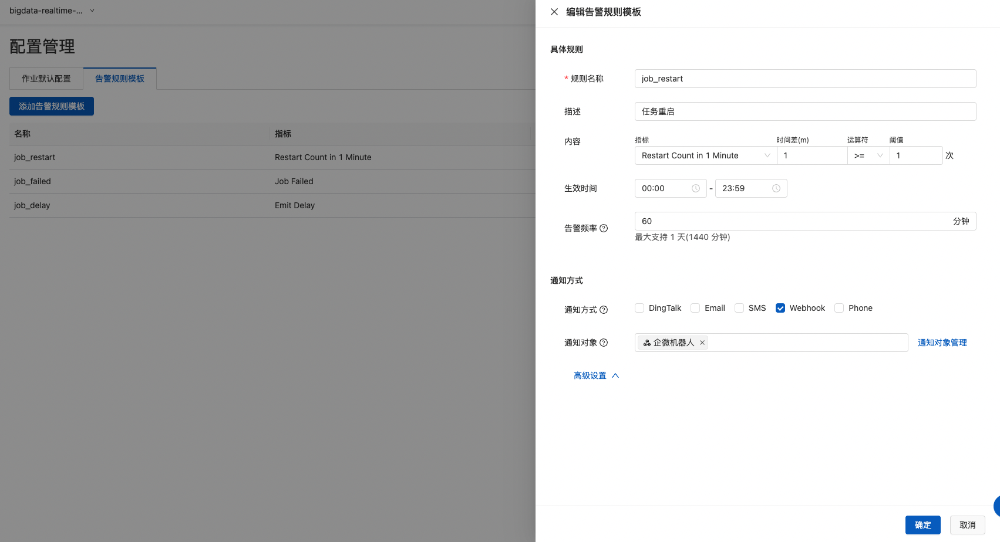

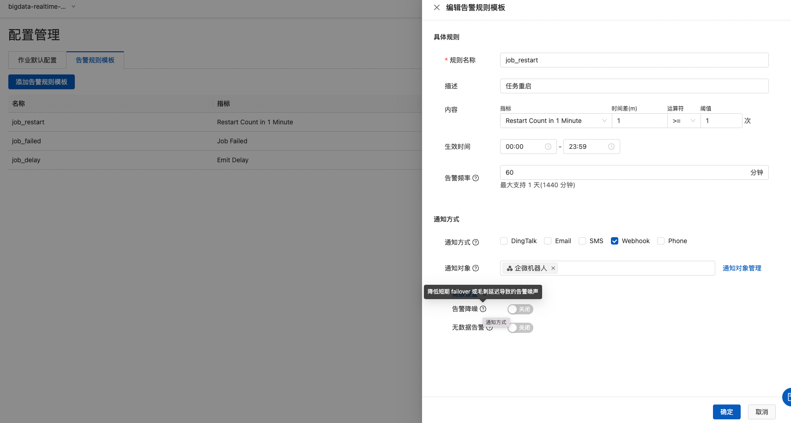

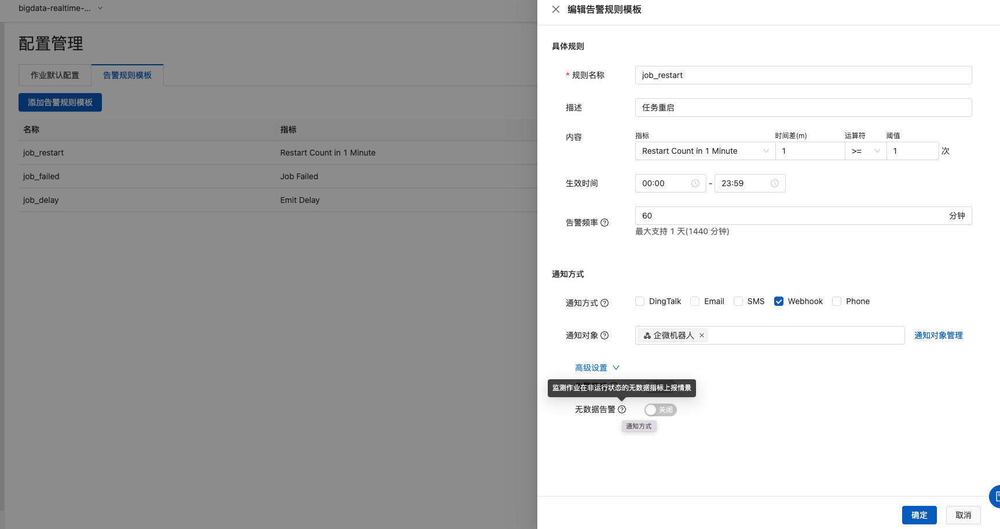

#### 指标配置

指标配置规则

```
任务重启(默认 1 分钟内) 次数。次数大于等于 1
delta(flink_jobmanager_job_numRestarts{deploymentId='{deploymentId}'}[1m]) >= 1.0

任务延迟。延迟大于 10 分钟，即 600s
max(flink_taskmanager_job_task_operator_currentEmitEventTimeLag{deploymentId='{deploymentId}'}/1000) >= 600.0
max by(ali_metric_deploymentName, deploymentId) (flink_taskmanager_job_task_operator_currentEmitEventTimeLag{deploymentId='{deploymentId}'}/1000) >= 600.0

checkpoint(默认 5 分钟内) 次数。次数小于等于 1
delta(flink_jobmanager_job_numberOfCompletedCheckpoints{deploymentId='{deploymentId}'}[5m]) <= 1.0

in rps。输入流量大于 1 条/秒
sum by(ali_metric_deploymentName, deploymentId) (flink_taskmanager_job_task_operator_source_numRecordsInPerSecond{deploymentId='{deploymentId}'}) >= 1.0

out rps。输出流量大于 1 条/秒
sum by(ali_metric_deploymentName, deploymentId) (flink_taskmanager_job_task_operator_sink_numRecordsOutPerSecond{deploymentId='{deploymentId}'}) >= 1.0

source 空闲时间。大于 1 毫秒
max by(ali_metric_deploymentName, deploymentId) (flink_taskmanager_job_task_operator_sourceIdleTime{deploymentId='{deploymentId}'}) >= 1.0
```

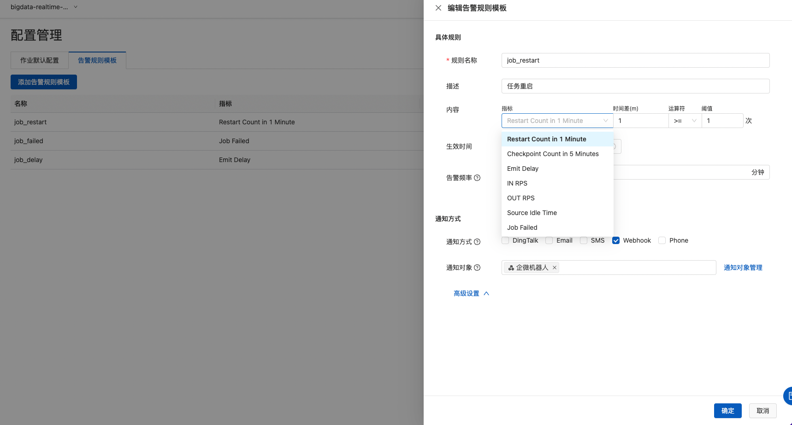

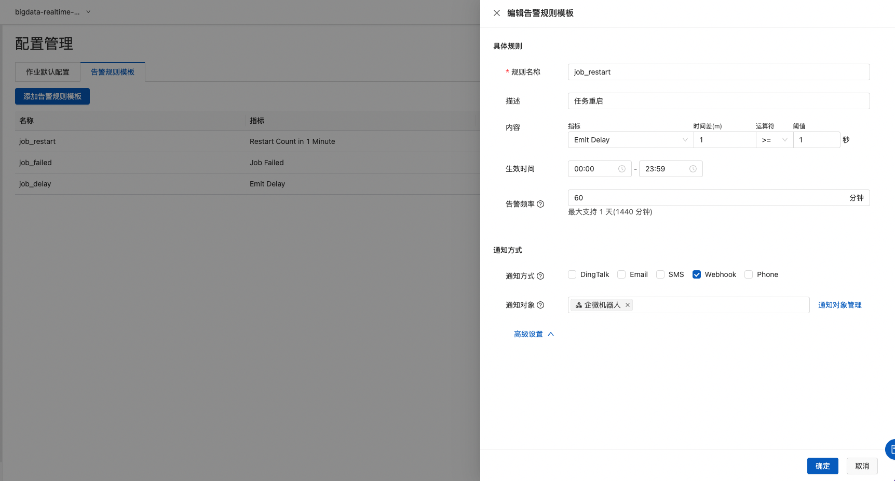

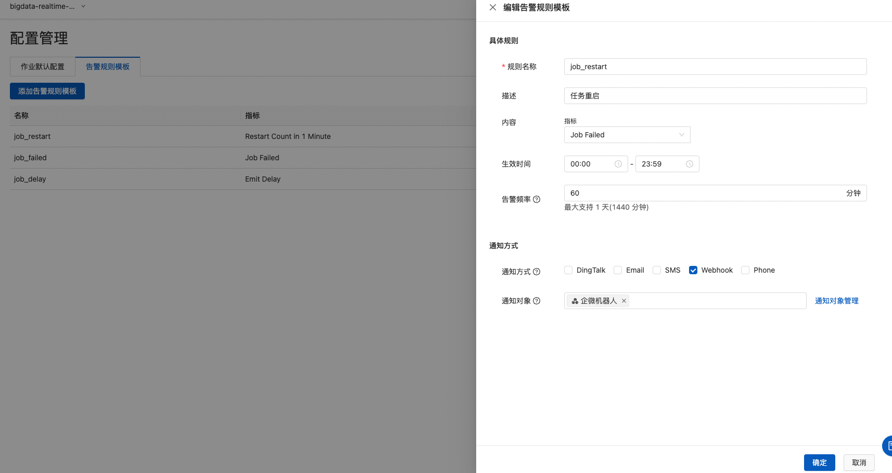


#### 通知管理

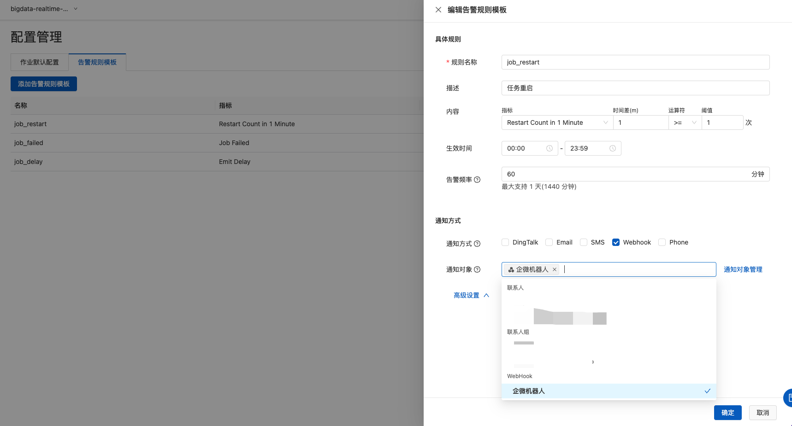

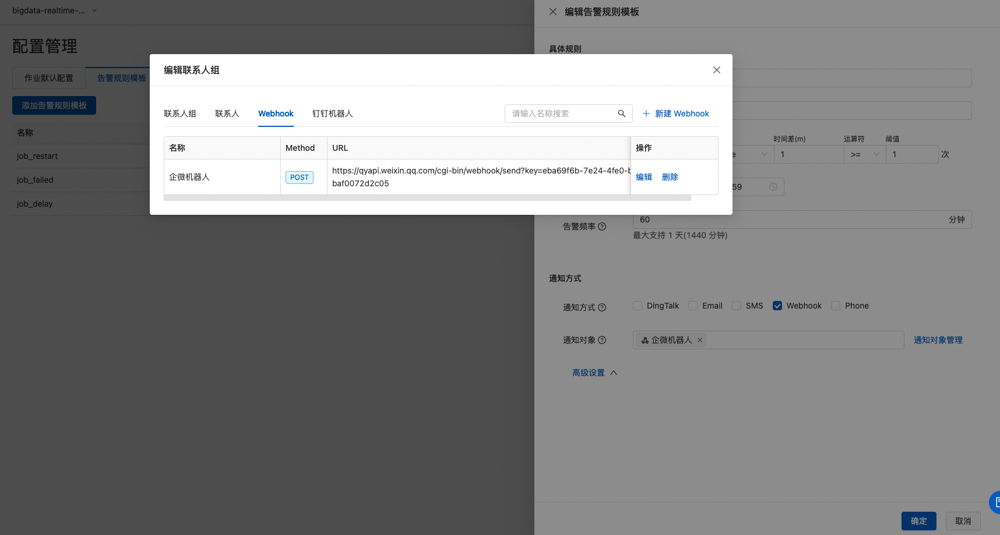

### 任务告警

#### 告警规则

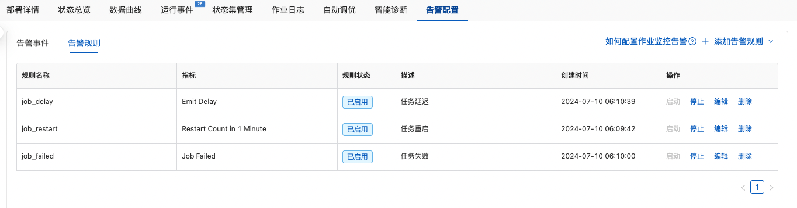

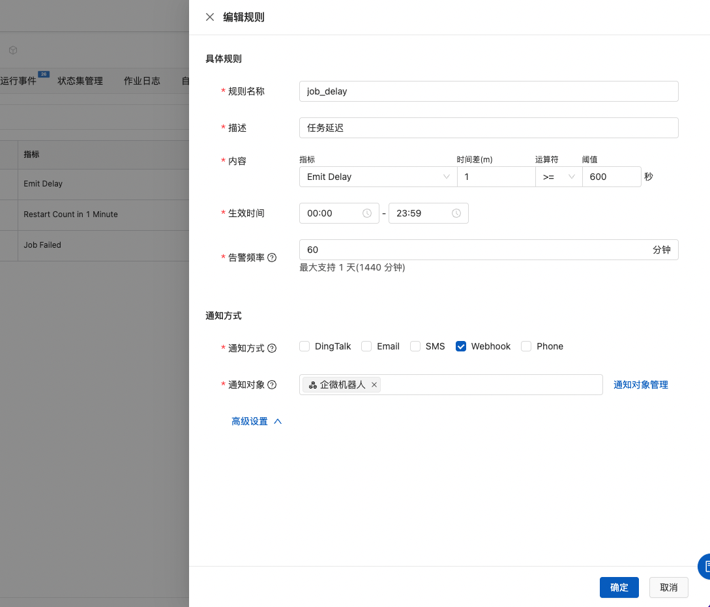

#### 告警历史

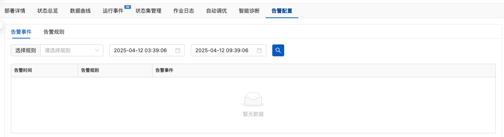

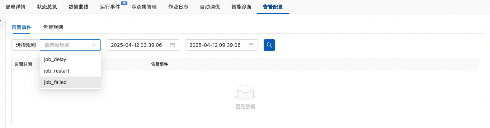


