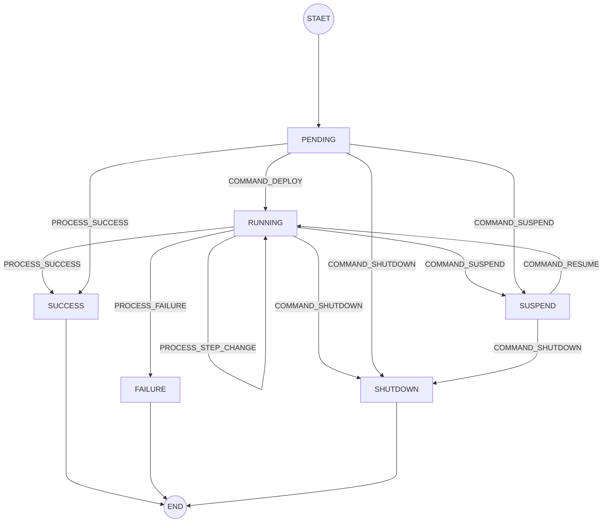
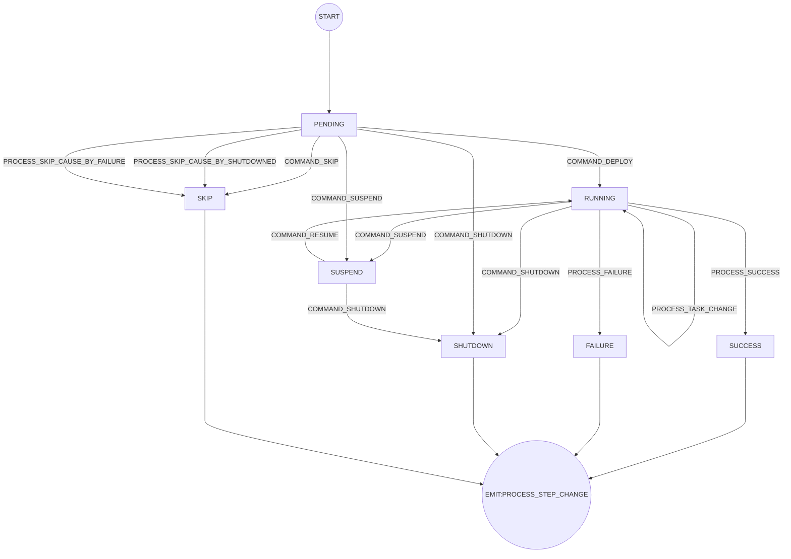
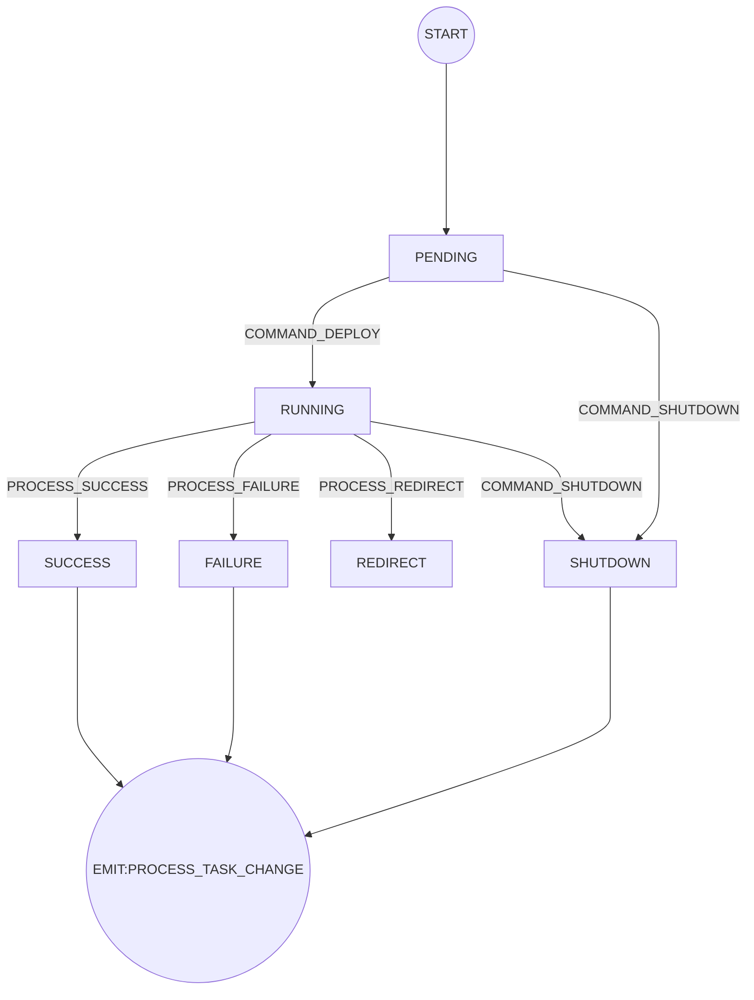

# 设计

资料整理

* 博客文章
  * 简易实现 DAG 任务编排
    * [在鸿蒙上200行代码实现基于工作流的启动编排设计](https://mp.weixin.qq.com/s/YCpgm61i3qEjai0qfnlsLg)
    * [Java 实现一个轻量的 DAG 任务调度 demo](https://www.cnblogs.com/Roni-i/p/17202280.html)
    * [DAG多任务编排驱动设计](https://mp.weixin.qq.com/s/Q5IMSYedtfmk5TWme4ysmw)
    * [基于DAG的任务编排框架/平台](https://mp.weixin.qq.com/s/mNWha03ceqVvWXiyXs3p6A)
    * [JavaFlow：轻量级工作流编排利器的设计与实现](https://mp.weixin.qq.com/s/gNMYp0wz_Gjb0sFfLbzt2A)
  * [A DAG Printer in Java](https://juejin.cn/post/7357292176944971803)
  * [赋能转转回收：LiteFlow可视化编排方案设计](https://mp.weixin.qq.com/s/Go6cDZvuvN-NH_gxcg77uw)
  * [MaxCompute 自适应执行引擎DAG 2.0为1.5亿分布式作业提供自动化保障](https://mp.weixin.qq.com/s/yOGEwyz5o1a1SVS2UGRHdQ)
  * [火山引擎数据调度实例的 DAG 优化方案](https://mp.weixin.qq.com/s/TIW1sh_dG_O-jtGoXAqIvQ)
  * [DAG 布局算法介绍&在流水线库中的应用](https://mp.weixin.qq.com/s/ACamz63ZmiNA4DslJFf2_g)
  * [手把手教你打造最好用的任务框架](https://mp.weixin.qq.com/s?__biz=MzU5NjkwOTg2Mw==&mid=2247484216&idx=1&sn=05e1767ed00bbc92feb6fd81bb93a308&chksm=ffd2d363ebb52fbfc0feb529dc4750c9cf01c9b914497d75148048f8e112ffeef81dc65a22ae&mpshare=1&scene=1&srcid=0125lJxVBUtFKvySvLZhQKmb&sharer_shareinfo=1cfd5e6ce4d07459f2fee2dde531fd21&sharer_shareinfo_first=1cfd5e6ce4d07459f2fee2dde531fd21&version=4.1.10.99312&platform=mac&nwr_flag=1#wechat_redirect)
* 开源项目
  * [dag-flow](https://github.com/sofn/dag-flow)
  * [dag-flow-platform](https://github.com/a925907195/dag-flow-platform)
  * [taskflow](https://github.com/peacepanda/taskflow)
  * [taskflow](https://github.com/ytyht226/taskflow)。[开源任务编排框架TaskFlow](https://mp.weixin.qq.com/s/wI2C5WAWdvfYhgOG6GL4-g)
  * [awesome-workflow-engines](https://github.com/meirwah/awesome-workflow-engines)

## 核心结构

### DAG

数据库存储

* [carp](https://github.com/flowerfine/carp-parent/blob/dev/tools/docker/mysql/init.d/carp-dag.sql)。存储节点和连线。
* [orca](https://github.com/spinnaker/orca/blob/master/orca-api/src/main/java/com/netflix/spinnaker/orca/api/pipeline/models/StageExecution.java)。存储依赖节点id，参考 `StageExecution#getRequisiteStageRefIds()`。
* [dolphinscheduler](https://github.com/apache/dolphinscheduler/blob/dev/dolphinscheduler-dao/src/main/resources/sql/dolphinscheduler_mysql.sql)。存储节点的上游节点和下游节点。`t_ds_workflow_definition`、`t_ds_task_definition`、`t_ds_workflow_task_relation`。任务相关的表：`t_ds_workflow_instance`、`t_ds_relation_workflow_instance`、`t_ds_task_instance`、`t_ds_task_instance_context`、`t_ds_relation_sub_workflow`

数据结构

* carp & dolphinscheduler。
  * [guava](https://github.com/google/guava/tree/master/guava/src/com/google/common/graph)。
  * [jgrapht](https://github.com/jgrapht/jgrapht)。[jgrapht.org/guide](https://jgrapht.org/guide/UserOverview)
* [orca](https://github.com/spinnaker/orca/blob/master/orca-api/src/main/java/com/netflix/spinnaker/orca/api/pipeline/models/StageExecution.java)。存储依赖节点id，参考 [`StageExecution#getRequisiteStageRefIds()`](https://github.com/spinnaker/orca/blob/master/orca-api/src/main/java/com/netflix/spinnaker/orca/api/pipeline/models/StageExecution.java) 和 [`StageExecutionImpl`](https://github.com/spinnaker/orca/blob/master/orca-core/src/main/java/com/netflix/spinnaker/orca/pipeline/model/StageExecutionImpl.java)。代码硬撸的

拓扑排序。对以 DAG 为数据结构的任务进行编排时，需通过**拓扑排序**处理任务前后依赖，执行 fan-in 和 fan-out 效果，

* [DAG（有向无环图）和拓扑排序](https://mp.weixin.qq.com/s/kR1CvXbumpbZ0XAYmC_rmg)
* [DAG调度算法原理与实践](https://mp.weixin.qq.com/s/ES2J_HmH0PjIWq4_KGRwww)
* 拓扑排序实现方式：
  * 广度优先搜索（BFS）
  * 深度优先搜索（DFS）
  * Kahn 算法。
    * [任务编排：DAG工作流实现](https://mp.weixin.qq.com/s/JLt7QWgyv7qTpQCwa9XJCQ)
    * [carp](https://github.com/flowerfine/carp-parent/blob/dev/carp-framework/carp-framework-dag/src/main/java/cn/sliew/carp/framework/dag/algorithm/DagUtil.java)

### 任务结构

* dag
  * workflow
  * pipeline

任务一般都是 dag，大致上分为 2 类：workflow 和 pipeline。

对于 CI/CD 系统来说，还有些阶段性划分，比如 github 上的项目管理，阿里云云效的流水线：

它们会先执行**串行**的 `stage`，每个`stage`内的`task`组成一个`dag`

### 任务管理

* 启动
* 停止
* 暂停
* 恢复

### 任务触发

* 回调
* 用户触发

### 子任务串联

* 队列+事件监听
* EventBus

队列定义

### 状态流转

* 状态机

### 参数传递

* 参数来源
  * 常量。由启动参数进行赋值，实际来自全局参数
  * 输出。step 和 task 的运行结果。只能获取到之前节点的输出，无法获取到之前节点的输入
  * 参数。step 和 task 运行期间动态添加
* 参数产生时机
  * 启动。可传入 dag 或 step 级别参数
  * 运行。主要是 step 和 task 的运行结果
* 动态表达式
  * condition 节点。for，if，switch 节点
  * retry expression

 ## 接口定义

* DAG
  * 基于 JGraph 封装的 DAG
  * 存储基于 carp-framework-dag
* 任务结构
  * `WorkflowDefition`、`WorkflowInstance`、`WorkflowState`
  * 任务层级。`workflow` -> `stage` -> `task`
  * 任务依赖。需同时
    * 直接通过 dag 的 node + edge 表示依赖关系
    * 手动添加依赖 stageA -成功> stageB，stageA -失败> stageC
* 任务执行。过滤器执行链 + 监听器：filter + handler -> listener
* 状态流转。
  * 状态机

## 状态机

### WorkflowInstance 状态机

### WorkflowStepInstance 状态机

### WorkflowTaskInstance 状态机

