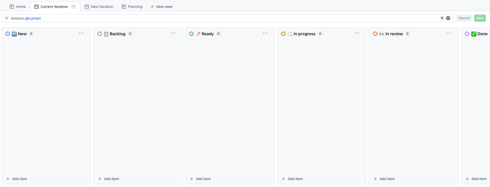
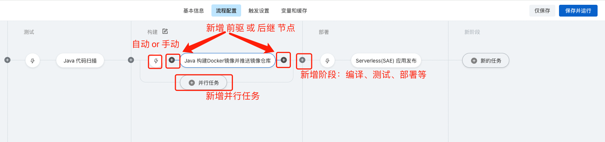
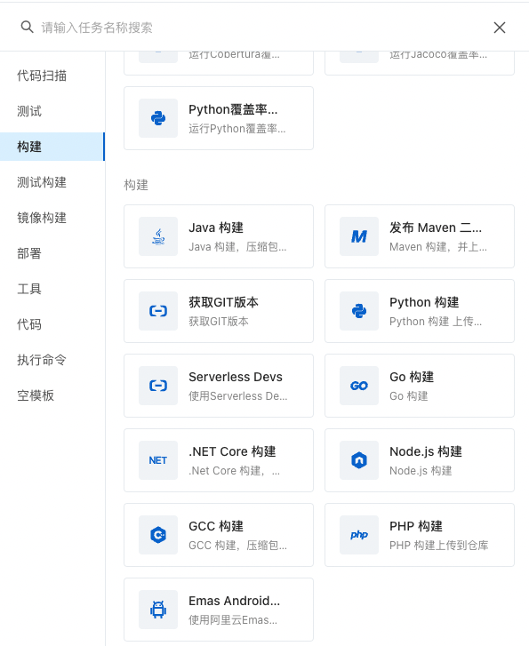

# 设计

## 核心结构

### DAG

存储

* carp。存储节点和连线
* [orca](https://github.com/spinnaker/orca/blob/master/orca-api/src/main/java/com/netflix/spinnaker/orca/api/pipeline/models/StageExecution.java)。存储依赖节点id，参考 `StageExecution#getRequisiteStageRefIds()`。
* [dolphinscheduler](https://github.com/apache/dolphinscheduler/blob/dev/dolphinscheduler-dao/src/main/resources/sql/dolphinscheduler_mysql.sql)。存储节点的上游节点和下游节点。`t_ds_workflow_definition`、`t_ds_task_definition`、`t_ds_workflow_task_relation`。任务相关的表：`t_ds_workflow_instance`、`t_ds_relation_workflow_instance`、`t_ds_task_instance`、`t_ds_task_instance_context`、`t_ds_relation_sub_workflow`

拓扑排序

### 任务结构

* dag
  * workflow
  * pipeline

任务一般都是 dag，大致上分为 2 类：workflow 和 pipeline。

对于 CI/CD 系统来说，还有些阶段性划分，比如 github 上的项目管理，阿里云云效的流水线：

它们会先执行**串行**的 `stage`，每个`stage`内的`task`组成一个`dag`

### 任务管理

* 启动
* 停止
* 暂停
* 恢复

### 任务触发

* 回调
* 用户触发

### 子任务串联

* 队列+事件监听
* EventBus

队列定义

### 状态流转

* 状态机

 