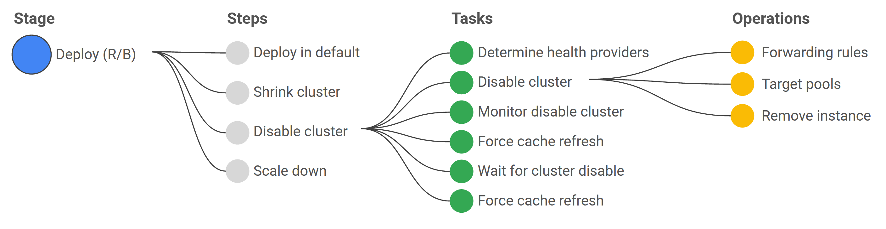

# Orca

[spinnaker](https://spinnaker.io/) 是一个多云交付系统，即 CI/CD 中的 CD 部分，定位类似于 [KubeVela](https://kubevela.io/zh/)。Spinnaker 源自于 Netflix，完全基于云服务，对接 aws 等云服务商，将应用部署到云服务中。和物理机类似的“包年包月”不同，Spinnaker 支持的是按量付费和动态伸缩，追求极致的弹性。Spinnaker 极其强大的一点在于多云交付，避免应用因为单一云服务故障导致应用不可用。

Spinnaker 采用[微服务架构](https://spinnaker.io/docs/reference/architecture/microservices-overview/)，[orca](https://github.com/spinnaker/orca) 是流程引擎。Spinnaker 的发布流水线由一个个 stage 组成，[deck](https://github.com/spinnaker/deck) 提供可视化界面将 stage 串联起来组成 pipeline。Orca 则具体执行 pipeline。在 Orca 中，pipeline 表示串行执行的 stages，还可以支持并行的 orchestration，但是不是 pipeline 只支持串行执行，而是因为 Spinnaker 是一个 CD 系统，pipeline 和 orchestration 是 Spinnaker 功能上的划分，pipeline 表示发布流水线，orchestration 表示可以在 ui 上由用户发起的任务。pipeline 本身是 DAG。

* DAG。支持丰富的编排支持上下游依赖的 stage 编排
  * 上下游依赖
  * 跨 pipeline 依赖
  * stage 组合。stage 支持设置 before、after 和 onFailure stage，多个 stage 合并成一个 stage
* stage 管理。暂停、恢复、撤销
* stage 易开发、易维护。stage 接口和 model 定义良好，对开发新的 stage 很友好，避免开发者绑定，易于新增、修改定制 stage
* Trigger。支持多种 trigger
* 参数传递。
  * 初始化参数。pipeline 级别
  * 运行参数。pipeline、stage 级别，task 的参数也可供下游使用
  * 模板参数。基于表达式的动态参数

参考链接：

* [spinnaker](https://spinnaker.io/)。
  * [application deployment](https://spinnaker.io/docs/concepts/#application-deployment)
  * [pipelines](https://spinnaker.io/docs/concepts/pipelines/)
  * [create a pipeline](https://spinnaker.io/docs/guides/user/pipeline/managing-pipelines/#create-a-pipeline)
  * [Pipeline Templates](https://spinnaker.io/docs/reference/pipeline/templates/)
  * [Plugin User Guide](https://spinnaker.io/docs/guides/user/plugins-users/)
  * [Test a Pipeline Stage Plugin](https://spinnaker.io/docs/guides/developer/plugin-creator/testing/plugin-deck-test/)
  * [Custom Job Stages](https://spinnaker.io/docs/guides/operator/custom-job-stages/)
  * [Custom Webhook Stages](https://spinnaker.io/docs/guides/operator/custom-webhook-stages/)
  * [Hiding Stages](https://spinnaker.io/docs/guides/operator/hiding-stages/)
  * [Writing a New Stage](https://spinnaker.io/docs/guides/developer/extending/new-stage/)
  * [Set up Orca to use SQL](https://spinnaker.io/docs/setup/productionize/persistence/orca-sql/)
  * [Orca: Redis to SQL Migration](https://spinnaker.io/docs/guides/operator/orca-redis-to-sql/)
  * [Horizontally Scale Spinnaker Services](https://spinnaker.io/docs/setup/productionize/scaling/horizontal-scaling/)
* [Spinnaker第七节—Orca代码详解](https://blog.csdn.net/yejingtao703/article/details/104246126)

## 原理介绍

Orca 将任务定义为 3 层：

* pipeline。`PipelineExecution`，有 2 种类型：`PIPELINE`、`ORCHESTRATION`。pipeline 由一系列的 stages 组成
* stage。`StageExecution`。stage 本身由一系列的 tasks 组成，tasks 之间组成一个 DAG
* task。`TaskExecution`。task 是最小粒度的划分，完成具体的任务

Orca 的实现基于事件驱动，基于发布-订阅模式，完成了 pipeline、stage 和 task 的启动、执行，上下游依赖。

事件驱动的核心为延迟队列，提供了一个抽象的队列接口，并提供了 Redis 和 MySQL 实现：

* 可扩展性。Orca 节点为队列消费者，可方便扩展
* 容错。队列具有重试功能
* 易维护。通过定义良好的 `Message` 和 `Handler`，功能清晰

在存储上，Orca 提供了 2 种实现：Redis 和 MySQL

* 队列。同时支持 Redis 和 MySQL，推荐使用 Redis
* Orca。同时支持 Redis 和 MySQL，推荐使用 MySQL

## 代码说明

### 核心模型

#### 延迟队列

`Queue`

`Message`

`QueueHandler`

`QueueProcessor`

#### 任务编排

* pipeline -> stage -> task。
  * `PipelineExecution`、`StageExecution`、`TaskExecution`、`Trigger`，
  * `StageGraphBuilder`、`StageDefitionBuilder`、`TaskNode`
  * `CancellableStage`、`Task`、`TaskExecutionInterceptor`
  * `StageListener`、`ExecutionListener`、`StageListenerAdapter`、`ExecutionListenerAdapter`
  * `StageResolver`、`TaskImplementationResolver`、`TaskResolver`
  * `ExecutionContext`、`StageContext`、`TaskContext`
  * `ExecutionRunner`、`ExecutionLauncher`
  * `ExecutionRepository`

### 状态机

执行 Pipeline -> Stage -> Task -> RunTask -> CompleteTask -> Complete Stage -> Complete Pipeline -> 

#### PipelineExecution 状态机

StartExecution -> 是否限制并发（如果有 pipelineConfigId）

#### StageExecution 状态机

#### TaskExecution状态机

### 处理逻辑

#### Cancel

`ForceExecutionCancellationCommand`。将执行中的 stage（排除未开始和已结束的）及其 task 设置为 `CANCELED`，execution 设置为 `CANCELED`

* `ExecutionRunner#cancel`
* `ExecutionRepository#cancel`

#### Pause & Resume

`CompoundExecutionOperator`

`ExecutionRunner`

`ExecutionLauncher`

* `ExecutionRunner#rescheduler`
* `ExecutionRepository#pause`
* `ExecutionRunner#unpause`
* `ExecutionRepository#resume`

#### Restart

* `ExecutionRunner#restart`
* `ExecutionRepository#restartStage`

### 上下文

orca 任务层级有 3 层构成：pipeline -> stage -> task。stage 包含多个 task，task 可通过 `REDIRECT` 反复执行。

* task。输出 context 和 output。output 对 stage 下其他 task 和 stage 可见，context 只对 stage 下其他 task 可见
* stage。接收 context，输出 output。context 可在创建时传入（承担 input 的作用），也可由 task 输出。output 为 task 输出。stage 可读取上游 stage 的 output。task 的 output 默认只会输出到 stages 的 output，其他 task 无法读取当前 stage 的 output，就会出现 task 无法获取其他 task 的 output。需要 task 将 output 主动复制到 context 中
* pipeline。context 为所有 stage 的 output

代码信息：

* pipeline。[PipelineExecutionImpl.java#getContext()](https://github.com/spinnaker/orca/blob/master/orca-core/src/main/java/com/netflix/spinnaker/orca/pipeline/model/PipelineExecutionImpl.java#L179)，
* stage。[StageExecutionImpl#context](https://github.com/spinnaker/orca/blob/master/orca-core/src/main/java/com/netflix/spinnaker/orca/pipeline/model/StageExecutionImpl.java#L226)，[StageExecutionImpl#outputs](https://github.com/spinnaker/orca/blob/master/orca-core/src/main/java/com/netflix/spinnaker/orca/pipeline/model/StageExecutionImpl.java#L241)，[StageContext#get()](https://github.com/spinnaker/orca/blob/master/orca-core/src/main/java/com/netflix/spinnaker/orca/pipeline/model/StageContext.java#L57)。[StageExecutionImpl#mapTo(Class)](https://github.com/spinnaker/orca/blob/master/orca-core/src/main/java/com/netflix/spinnaker/orca/pipeline/model/StageExecutionImpl.java#L607)。
* task。[TaskResult#context](https://github.com/spinnaker/orca/blob/master/orca-api/src/main/java/com/netflix/spinnaker/orca/api/pipeline/TaskResult.java#L55)，[TaskResult#outputs](https://github.com/spinnaker/orca/blob/master/orca-api/src/main/java/com/netflix/spinnaker/orca/api/pipeline/TaskResult.java#L65)。[RunTaskHandler#processTaskOutput](https://github.com/spinnaker/orca/blob/master/orca-queue/src/main/kotlin/com/netflix/spinnaker/orca/q/handler/RunTaskHandler.kt#L462)，[ExpressionAware#withMergedContext](https://github.com/spinnaker/orca/blob/master/orca-queue/src/main/kotlin/com/netflix/spinnaker/orca/q/handler/ExpressionAware.kt#L50)

## 功能扩展

流程编排方式：

* 编程编排
* 可视化
* yaml 编辑

序列化。默认是以 jackson 为序列化方式

* 支持标准的序列化接口

接口声明。为方便实现三方 stage 和 task，提供标准的接口和内部实现，发布至 maven 供三方实现

