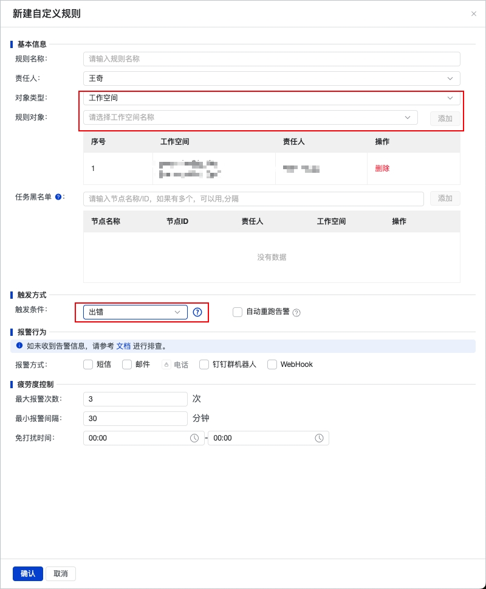

# 项目管理

## 项目空间初始化

workflow 目录初始化。系统自带的工作流没有业务意义，可删除重建自己的，比如 直播、淘宝、出行、租赁等

数据集成。

* 数据源。创建数据源
* 虚拟节点。数据先行，数仓往往是从先把数据同步到数仓开始的，可为不同的数据库建立不同的 `虚拟节点`，后面数据库下面的表的数据集成任务都依赖对应的 `虚拟节点`，方便管理。

告警。

* 工作空间级别。为工作空间设置告警，任务失败发送告警通知。进入【运维中心】，在侧边栏可以找到【监控报警】-> 【规则管理】中创建告警规则

## 权限管理

