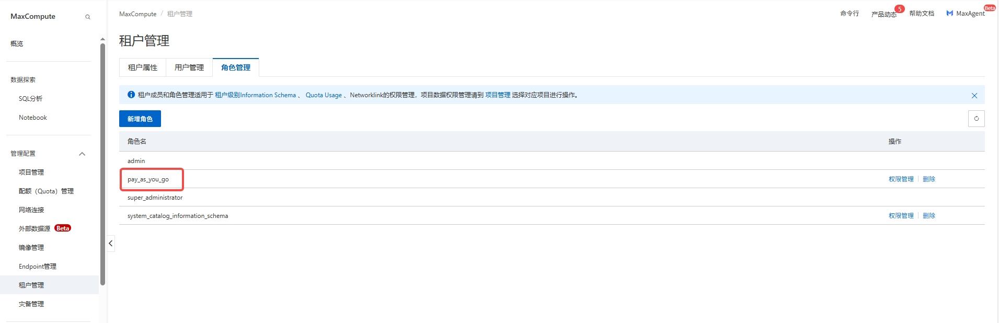
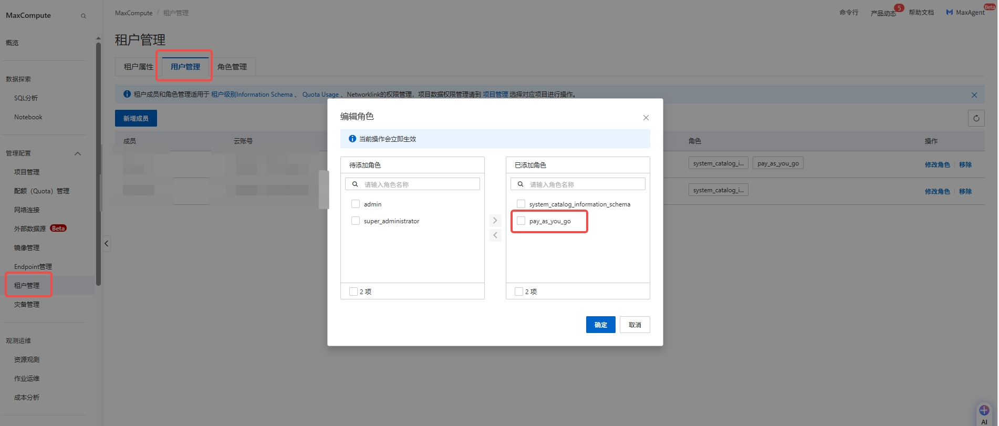
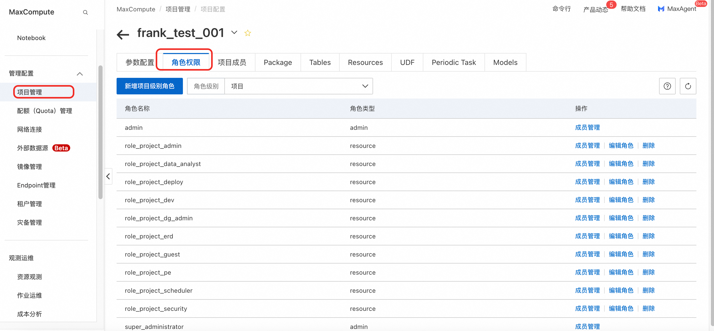
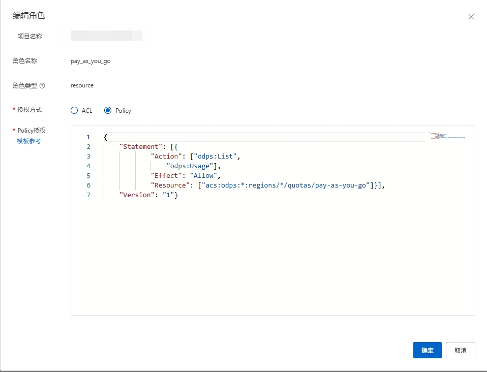
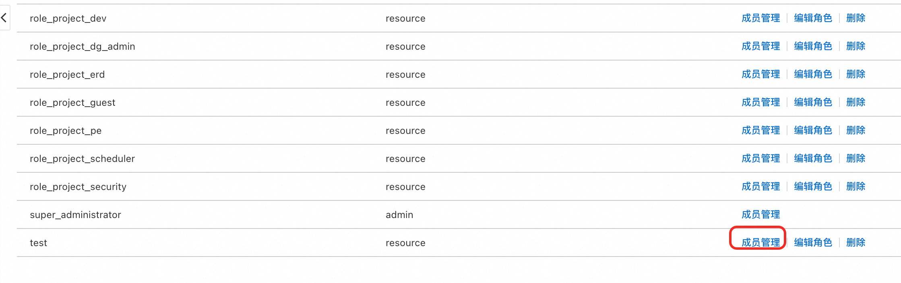
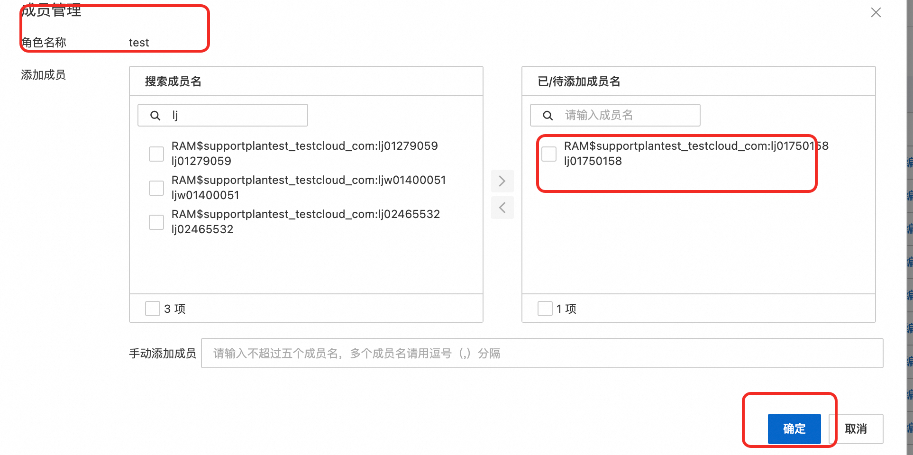

# SelectDB 连接 DataWorks

在湖仓一体的大背景下，DataWorks 提供了开放存储（Storage API），三方计算引擎可以通过调用 Storage API 直接访问 MaxCompute 的底层存储，实现联邦查询和对 DataWorks 上的数据查询加速。

这里利用阿里云 SelectDB 的湖仓一体功能，对 MaxCompute 的支持实现的。

## MaxCompute 开放存储

在 MaxCompute 的租户管理目录下开放 Storage 功能，并设置授权

* 启用 Storage。在【租户管理】->【租户属性】开启
* 创建角色。在【租户管理】->【角色管理】创建角色 `pay_as_you_go`，内容参照 MaxCompute 开放存储概览中的权限配置
* 为用户赋权。在【租户管理】->【用户管理】为用户添加角色：`pay_as_you_go`





授权方式为 `Policy`，权限内容如下：

```json
{
    "Statement": [
        {
            "Action": [
                "odps:List",
                "odps:Usage"
            ],
            "Effect": "Allow",
            "Resource": [
                "acs:odps:*:regions/*/quotas/pay-as-you-go"
            ]
        }
    ],
    "Version": "1"
}
```



阿里云技术人员说也可以在 DataWorks 的项目空间配置，但实际上没跑通：









## SelectDB 创建 MaxCompute 数据源

按照文档创建 catalog，SQL 实例如下：

```sql
CREATE CATALOG mc PROPERTIES (
 "type" = "max_compute",
 "mc.region" = "cn-hangzhou",
 "mc.default.project" = "yourProject",
 "mc.access_key" = "yourAccessKeyID",
 "mc.secret_key" = "yourAccessKeySecret",
 "mc.endpoint" = "https://service.cn-hangzhou-vpc.maxcompute.aliyun-inc.com/api"
);
```

`https://service.cn-hangzhou-vpc.maxcompute.aliyun-inc.com/api` 为内网地址，公网地址为 `https://service.cn-hangzhou.maxcompute.aliyun-inc.com/api`，移除 `-vpc` 即可。如果使用公网需在增加配置：

```sql
"mc.public_access"="true"
```

这里有个坑爹的地方：`mc.default.project`，它只能访问这一个项目空间。通过在 SelectDB 的 SQL 编辑器页面，一起提交 SQL：

```sql
switch maxcompute_catalog;
show databases;
```

可以看到返回的 Database 只有 `mc.default.project` 配置的项目空间，查询时查询其他项目空间，也无法查询。

实际查询时：

```sql
select * from maxcompute_catalog.my_project.dwd_my_dwd_table where ds = '20251001';
```

## 参考文档

* [SelectDB 湖仓一体-数据湖分析-阿里云MaxCompute数据源](https://help.aliyun.com/zh/selectdb/alibaba-cloud-maxcompute-data-source)
* [MaxCompute-运维管理-租户管理-租户属性](https://help.aliyun.com/zh/maxcompute/user-guide/tenant-information)
* [MaxCompute-湖仓开放架构-开放存储-开放存储概览](https://help.aliyun.com/zh/maxcompute/user-guide/overview-1)
