# Keycloak


## 部署

使用 docker compose 快速部署 keycloak。

两个关键点：

* 数据库。目前使用 postgresql 部署最为流畅，mysql 没折腾出来。
* TLS。keycloak 默认启用 TLS 保护 http 接口，如果是开发体验可关闭 TLS。
  * 启动后，需通过数据库工具进入数据库，手动修改数据库中 realm 配置，关闭 TLS。

```yaml
version: '3.1'

services:

  postgresql:
    image: bitnamilegacy/postgresql:16.2.0
    environment:
      - ALLOW_EMPTY_PASSWORD=yes
      - POSTGRESQL_USERNAME=bn_keycloak
      - POSTGRESQL_DATABASE=bitnami_keycloak
    ports:
      - '5432:5432'
    networks:
      - keycloak

  keycloak:
    image: bitnamilegacy/keycloak:26.2.5
    depends_on:
      - postgresql
    environment:
      - KEYCLOAK_CREATE_ADMIN_USER=true
      - KEYCLOAK_ADMIN_USER=user
      - KEYCLOAK_ADMIN_PASSWORD=bitnami
      - KEYCLOAK_JDBC_DRIVER=postgresql
      - KEYCLOAK_DATABASE_VENDOR=postgresql
      - KEYCLOAK_DATABASE_HOST=postgresql
      - KEYCLOAK_DATABASE_PORT=5432
      - KEYCLOAK_DATABASE_NAME=bitnami_keycloak
      - KEYCLOAK_DATABASE_USER=bn_keycloak
      - KEYCLOAK_ENABLE_HTTPS=false # 关闭https
      - KC_HTTP_PORT=8089
    ports:
      - '10020:8089'
    networks:
      - keycloak

networks:
  keycloak:
    driver: bridge
```

进入数据库，关闭 TLS

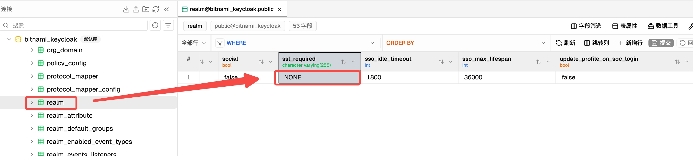

Keycloak 登陆信息如下：

* 地址。http://localhost:10020。这里把端口号改成了 10020，避免与本地的一些端口冲突
* 用户名密码。user / bitnami

## 配置 Keycloak

### 配置 client

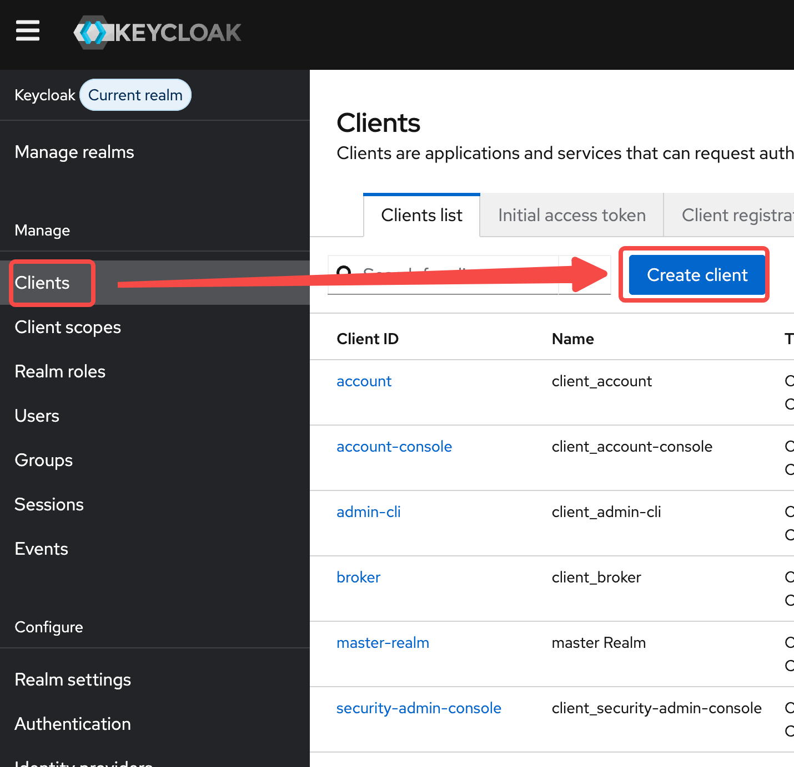

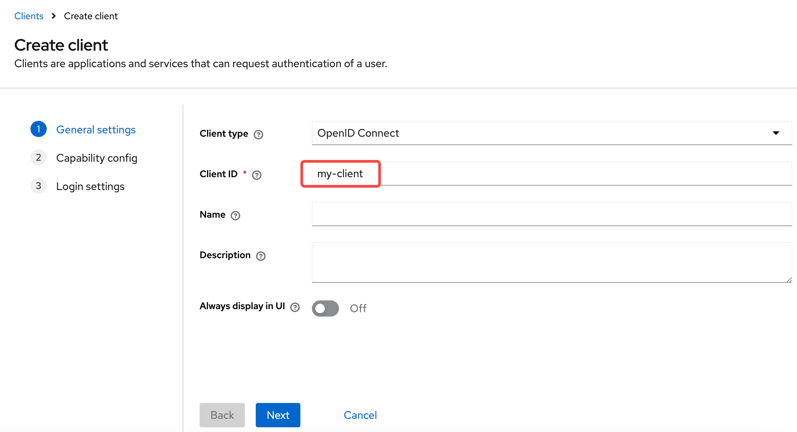

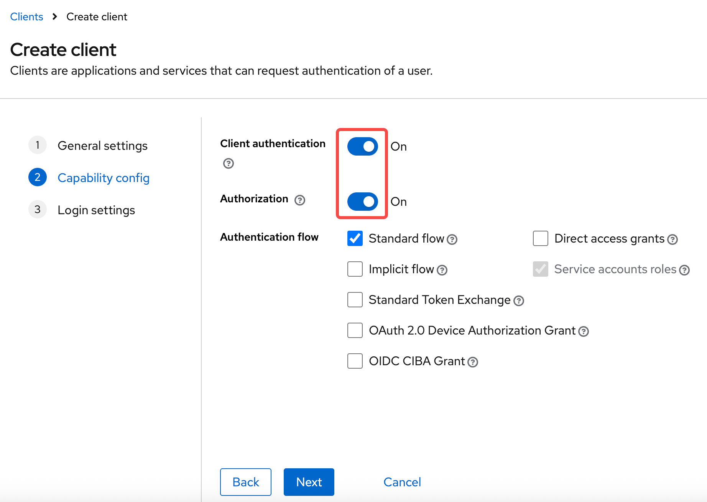

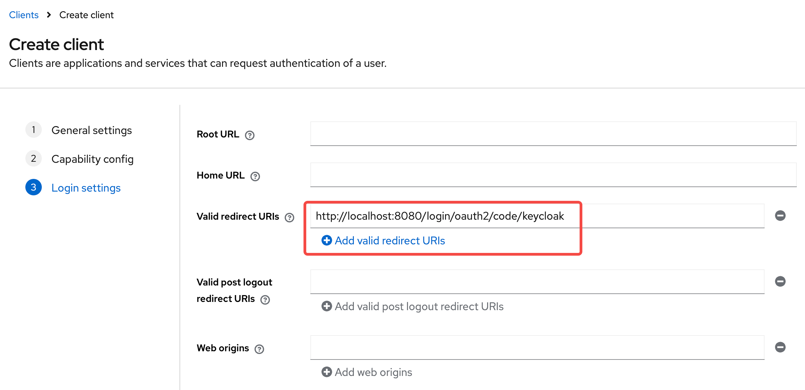

创建用户完毕后，需要记录下 client-secret，client-id 就是创建的 client 名称：`my-client`

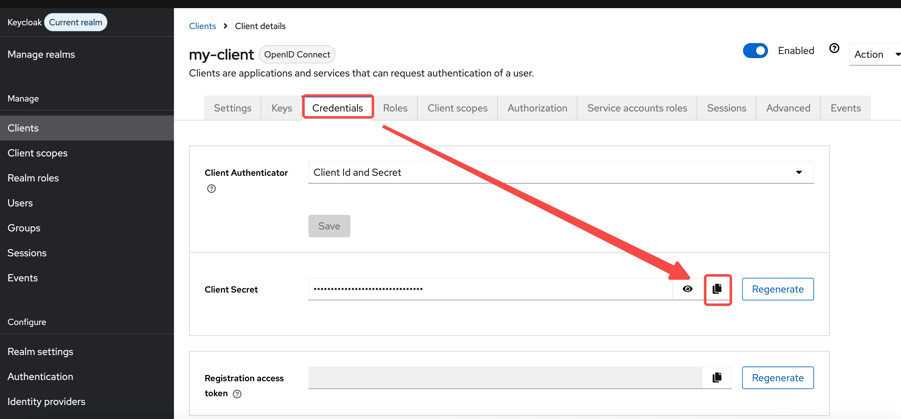

### 配置角色

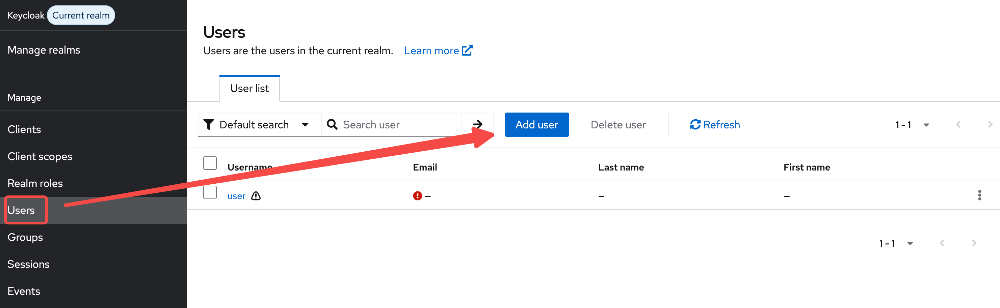

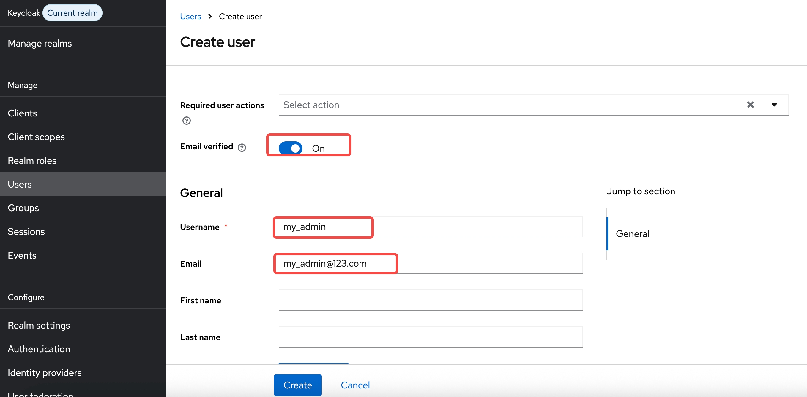

keycloak 支持两种角色：client-roles 和 realm-roles。这里简单介绍 client-roles 创建

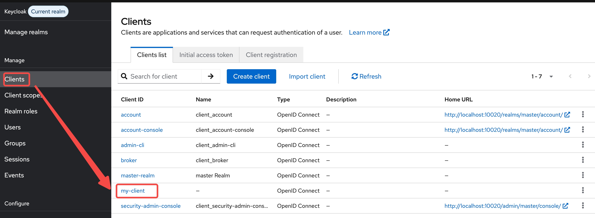

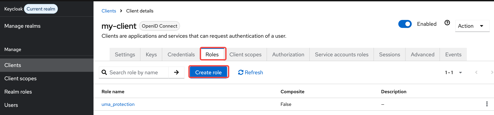

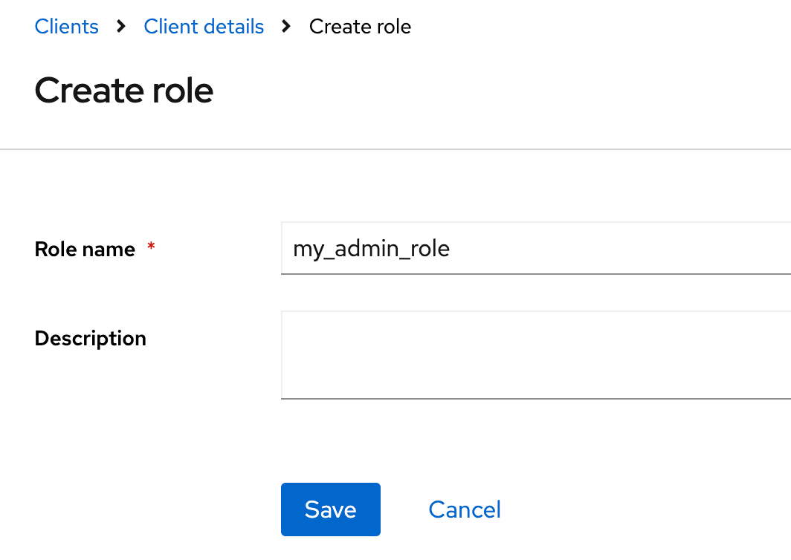

后续就可以给用户添加角色

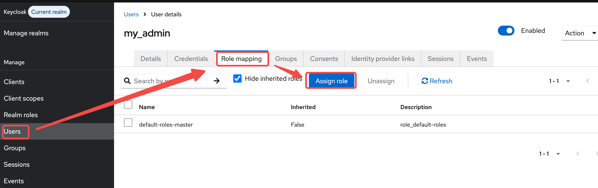

### 获取角色配置

在多个支持 OIDC 的开源或闭源，只能支持登陆认证，也就是 SSO，不支持鉴权环节。问题就在于需要获取到拥有的角色，或者授权策略。

这里简单介绍通过 keycloak 自定义的 scope 获取到用户拥有的角色。通过这种方式介绍自定义 scope 的使用

> [!CAUTION]
>
> keycloak 本身是支持授权管理的，如 RBAC、ABAC。这里介绍的方式并不是 keycloak 本身的授权管理功能

新建一个 client scope，命名为 `my-roles`：

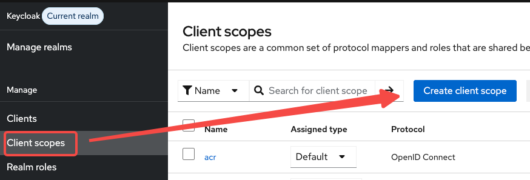

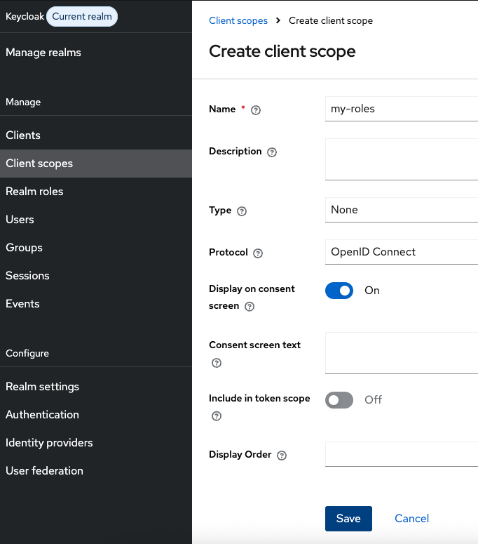

添加 `mapper` 获取到 keycloak 中用户拥有的角色：

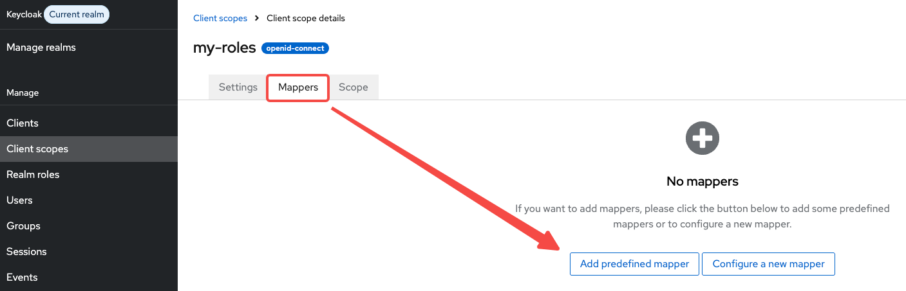

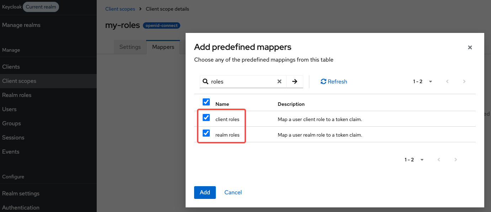

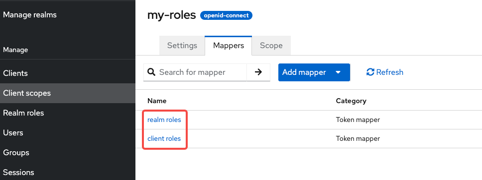

在预定义的 `realm roles` 和 `client roles` mapper 是把角色放到 access-token 里面，可以调整把角色信息放到 id-token 和 user-info 里面：

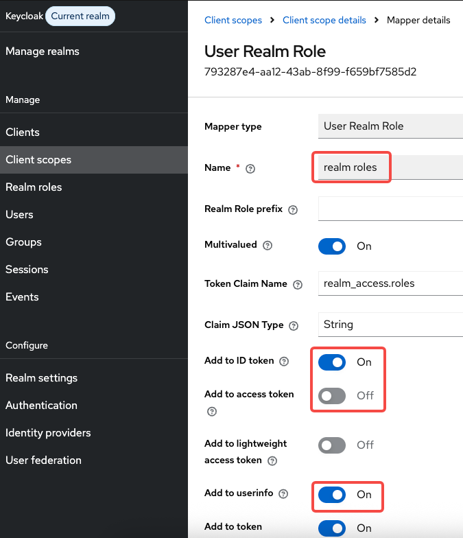

把自定义的 scope `my-roles` 添加定义的 client `my-client` 即可，后续即可在 spring security 接入时声明需要的 scope 中加入 `my-roles`，然后就可以在 id-token 和 user-info 中获取到用户拥有的 client roles 和 realm roles

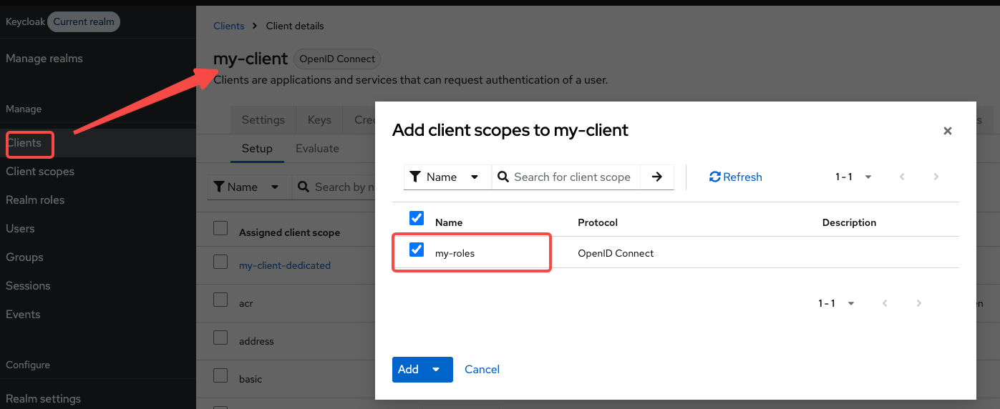

## Spring Security 接入


## 参考链接

* [Keycloak](https://keycloak.com.cn/)
