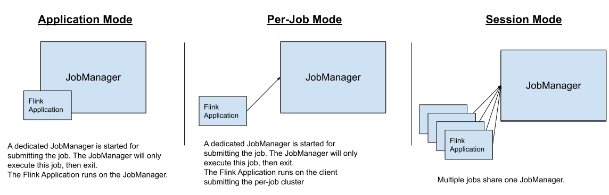

# Flink 部署模式

Flink 是一个功能强大的框架，支持多种形式的部署。根据部署方式的不同，Flink 的不同组件的作用和实现方式也会不同。

## 部署模式

Flink 支持 3 中部署模式：

* Application。
* Per-Job。
* Session。

三种模式的区别在于：

* 集群生命周期和资源隔离。
  * 生命周期。任务结束时，集群是否关闭，多个任务一起运行时，集群如何关闭。
  * JobManager 和 TaskManager 两方面影响，不同任务之间影响。如果 JobManager 发生容错，会导致所有任务 recovery，如果 TaskManager 发生容错，会导致有 Task 在 TaskManager 上运行的任务 recovery，同一台 TaskManager 不同的 Task 也会争抢资源。TaskManager 的 slot 均分内存，共享 CPU。

* 应用 `main()` 方法在 client 还是 JobManager 执行。
  * client 在执行提交任务时，需下载应用程序依赖，执行 `main()` 方法构建 JobGraph，将依赖和 JobGraph 发送至 JobManager。此过程需消耗网络带宽下载依赖，CPU 执行 `main()` 方法。
  * 参考 [美团 Flink 大作业部署与状态稳定性优化实践](https://flink-learning.org.cn/article/detail/3f0bb4391f26c5803c44504529cc9415) 部分文章。




### Application Mode

在 client 进行任务提交时会先在本地下载应用依赖，执行 `main()` 方法并传输依赖和 `JobGrapth` 到 JobManager。因此 client 是一个资源重度消耗者，它需要大量网络带宽下载依赖、发送二进制 jar 包到 JobManager，消耗 CPU 资源执行 `main()` 方法，当大量用户共享一个 client 时，任务提交会变得很慢。

在 Application 模式下，`main()` 方法是在 JobManager 执行的。提交任务时会为每个应用创建一个 Flink 集群，JobManager 负责 `main()` 方法的执行。Application 和 Per-Job 类似，都会创建一个集群，但是 Application 模式下 `main()` 可以多次调用 `execute()` 和 `executeAsync()` 创建多个任务。`execute()` 是阻塞的，导致任务之间的运行是顺序的，`executeAsync()` 是非阻塞的，任务之间的运行是随机的。Application 模式下应用具有与 Per-Job 模式一致的资源隔离和负载均衡，应用内部的任务共享资源。

Application 模式主要解决依赖下载和传输问题。Flink 应用在编写的时候需要将 DataStream/DataSet 等 API 依赖设置为 `provided`，因为 Flink 在 `lib` 目录下提供了核心依赖 jar 包，应用只需要提供自己需要的依赖即可。Application 假设应用提供的是一个 Fat Jar，包含了运行所需的所有的依赖，包括 Flink 的核心依赖，JobManager 和 TaskManager 不会出现缺少类定义的问题。

Application 模式通过避免在组件间分发应用 jar 以提升应用 deployment / recovery 速度。

Application 模式应用内任务的执行顺序取决于 `execute()` 和 `executeAsync()` 的执行顺序。`execute()` 是阻塞的，只有当前一个任务执行完毕后，后一个任务才会启动并执行。

手动取消任一个应用内任务都会触发所有任务停止，JobManager 关闭。任务正常的执行结束并不会触发其他任务停止，所有任务正常结束时 JobManager 关闭。

### Per-Job Mode

Per-Job 模式通过资源提供者（Kubernetes、YARN）为每个提交的任务拉起一个集群，集群仅属于这个任务，任务结束集群销毁资源释放，Per-Job 模式可以为任务提供最高的资源隔离性。

### Session Mode

Session 模式下会将任务提交到运行中的集群，所有提交的应用使用相同的资源。Session 模式并不需要背负为应用创建新集群的负载，但是如果某个任务引发 TaskManager 异常，会影响所有运行在那个 TaskManager 上的任务，除此之外受影响任务的集中 recovery 也可能会带来新的风险。Session 模式下 JobManager 也会承担更多的负载。

## Flink 架构

Flink 的组件分为 2 部分：内部组件和外部组件，内部组件是必需的，会根据部署方式的不同，有不同的实现，外部组件属于可选组件。


内部组件：

* 客户端。客户端将 Flink 应用代码转化为 `JobGraph` 并提交给 `JobManager`。
* JobManager。Flink 任务协调器，负责分配资源，最终将 `JobGraph` 转化成 `ExecutionGraph` 并提交给 `TaskManager`。
* TaskManager。真正运行 Flink 算子（source、transformations 和 sinks）的地方。

### 客户端

Flink 应用有多种实现方式，比如 `Java`、`Scala`、`Python` 和 `SQL`，对应的也有多种客户端实现。除此之外，还有 `CLI` 和 `REST`接口等方式。

#### Command-Line Interface (CLI)

Flink 集群可以通过 `REST` 端口进行管理，CLI 接口通过 `curl` 等工具对 `REST` 端口进行封装，实现 Flink 任务的生命周期管理，如创建、查看、取消和 savepoint 等操作。

CLI 支持的命令如下：

| Action          | 作用                                                         |
| --------------- | ------------------------------------------------------------ |
| run             | 执行任务。必需提供包含任务的 jar 包，集群配置信息使用 `conf/flink-conf.yaml` |
| run-application | 以 `Application Mode` 执行任务。参数与 `run` 命令一致。      |
| list            | 查看所有运行中和已调度的任务。                               |
| cancel          | 使用 `JobID` 取消运行中的任务。`run` 和 `run-application` 执行任务时会返回 `JobID` 或通过 `list` 查找。 |
| stop            | `stop` 命令时 `cancel` 和 `savepoint` 命令的综合，在取消任务的同时创建一个 savepoint。 |
| savepoint       | 使用 `JobID` 创建或销毁 savepoints。如果 `conf/flink-conf.yaml` 没有指定 `state.savepoints.dir` 参数，需提供 savepoint 目录。 |
| info            | 获取任务优化后的执行图，必需提供包含任务的 jar 包。          |

更加详细的信息可以通过 `bin/flink --help` 或 `bin/flink <action> --help` 命令查看。

##### 提交任务

提交任务通过 `run` 和 `run-application` 命令：

```shell
./bin/flink run --detached ./examples/streaming/StateMachineExample.jar
```

因为 Flink 有多种部署方式，如 Standalone、Kubernetes 和 YARN，不同的部署方式下支持不同的运行方式，提交任务使用的参数也有所差异。

`run` 命令支持 Per-Job 和 Session 模式提交，`run-application` 支持 Application 模式提交，而 Standalone、Kubernetes 和 YARN 集群部署方式下，可以使用 `--target` 参数覆盖 `conf/flink-conf.yaml` 中 `execution.target` 配置，指定任务提交到不同部署方式的集群，使用不同的运行方式：

- Standalone:
    - `./bin/flink run --target local`: Local submission using a MiniCluster in Session Mode
    - `./bin/flink run --target remote`: Submission to an already running Flink cluster
- YARN
    - `./bin/flink run --target yarn-session`: Submission to an already running Flink on YARN cluster
    - `./bin/flink run --target yarn-per-job`: Submission spinning up a Flink on YARN cluster in Per-Job Mode
    - `./bin/flink run-application --target yarn-application`: Submission spinning up Flink on YARN cluster in Application Mode
- Kubernetes
    - `./bin/flink run --target kubernetes-session`: Submission to an already running Flink on Kubernetes cluster
    - `./bin/flink run-application --target kubernetes-application`: Submission spinning up a Flink on Kubernetes cluster in Application Mode

##### 查看任务

`list` 命令可以查看运行中和已调度的任务。当任务已经提交还未被 JobManager 调度运行时会显示为已调度。

```shell
 ./bin/flink list
```

##### savepoint

创建 savepoint：

```shell
./bin/flink savepoint $JOB_ID /tmp/flink-savepoints
```

如果 `conf/flink-conf.yaml` 中未配置 `state.savepoints.dir`，需要指定 savepoint 路径。

销毁 savepoint：

```shell
./bin/flink savepoint --dispose /tmp/flink-savepoints/savepoint-cca7bc-bb1e257f0dab $JOB_ID
```

##### 停止任务

优雅停止任务。停止流式任务时，可以在停止任务前先创建一个 savepoint，以便在重启任务时能够使用之前的 savepoint 启动任务。

```shell
 ./bin/flink stop --savepointPath /tmp/flink-savepoints $JOB_ID
```

使用 savepoint 提交任务：

```shell
./bin/flink run --detached --fromSavepoint /tmp/flink-savepoints/savepoint-cca7bc-bb1e257f0dab ./examples/streaming/StateMachineExample.jar
```

仅停止任务，不创建 savepoint：

```shell
./bin/flink cancel $JOB_ID
```


| 序号 | 商品id     | 商品名称     | 销量 | 销售额 |
| ---- | ---------- | ------------ | ---- | ------ |
| 1    | xxxxyyyzzz | 我是一个商品 | 10   | 1000   |
| 2    | aaaabbbccc | 我是一个商品 | 20   | 2000   |
