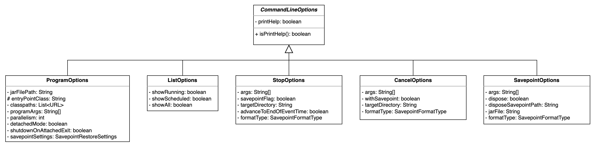

# Flink——任务提交(一)

## 参数

### 命令行参数

Flink 客户端从命令行中获取提交任务的参数，命令行参数解析使用的是 apache 的命令行解析工具：

```xml
<dependency>
    <groupId>commons-cli</groupId>
    <artifactId>commons-cli</artifactId>
</dependency>
```

Flink 命令行接口支持的命令如下，覆盖任务执行的各个生命周期：

* `run` 和 `run-application`。任务提交。
* `list`。查看已调度和运行中的任务。当任务提交后还未真正运行时任务状态为已调度，当运行结束后无法通过 `list` 命令查看。
* `savepoint`。创建 savepoint。
* `cancel` 和 `stop`。停止任务。

不同命令执行的参数会最后解析为 `CommandLineOptions`，`CommandLineOptions` 是个抽象类，总共有 5 个继承类，分别对应着几个命令：



命令行解析时需要预先定义对应的参数类：

```java
static final Option HELP_OPTION = new Option("h", "help", false, "Show the help message for the CLI Frontend or the action.");
```

通过 `DefaultParser#parse(Options, String[], boolean)` 进行解析，解析结果为 `CommandLine`。

Flink 客户端主要定义命令行参数的实现主要在 `CliFrontendParser` 类中：

```java
public class CliFrontendParser {

    static final Option HELP_OPTION = new Option("h", "help", false, "Show the help message for the CLI Frontend or the action.");

    // .......

    public static CommandLine parse(Options options, String[] args, boolean stopAtNonOptions)
            throws CliArgsException {
        final DefaultParser parser = new DefaultParser();

        try {
            return new DefaultParser().parse(options, args, stopAtNonOptions);
        } catch (ParseException e) {
            throw new CliArgsException(e.getMessage());
        }
    }
}
```

而 `CommandLine` 就可以解析封装成相应的 `ProgramOptions` 参数对象，其他参数如 `ListOptions` 与之类似：

```java
public class ProgramOptions extends CommandLineOptions {

    private String jarFilePath;

    protected String entryPointClass;

    private final List<URL> classpaths;

    private final String[] programArgs;

    private final int parallelism;

    private final boolean detachedMode;

    private final boolean shutdownOnAttachedExit;

    private final SavepointRestoreSettings savepointSettings;

    protected ProgramOptions(CommandLine line) throws CliArgsException {
        super(line);

        this.entryPointClass =
                line.hasOption(CLASS_OPTION.getOpt())
                        ? line.getOptionValue(CLASS_OPTION.getOpt())
                        : null;

        this.jarFilePath =
                line.hasOption(JAR_OPTION.getOpt())
                        ? line.getOptionValue(JAR_OPTION.getOpt())
                        : null;

        this.programArgs = extractProgramArgs(line);

        List<URL> classpaths = new ArrayList<URL>();
        if (line.hasOption(CLASSPATH_OPTION.getOpt())) {
            for (String path : line.getOptionValues(CLASSPATH_OPTION.getOpt())) {
                try {
                    classpaths.add(new URL(path));
                } catch (MalformedURLException e) {
                    throw new CliArgsException("Bad syntax for classpath: " + path);
                }
            }
        }
        this.classpaths = classpaths;

        if (line.hasOption(PARALLELISM_OPTION.getOpt())) {
            String parString = line.getOptionValue(PARALLELISM_OPTION.getOpt());
            try {
                parallelism = Integer.parseInt(parString);
                if (parallelism <= 0) {
                    throw new NumberFormatException();
                }
            } catch (NumberFormatException e) {
                throw new CliArgsException(
                        "The parallelism must be a positive number: " + parString);
            }
        } else {
            parallelism = ExecutionConfig.PARALLELISM_DEFAULT;
        }

        detachedMode =
                line.hasOption(DETACHED_OPTION.getOpt())
                        || line.hasOption(YARN_DETACHED_OPTION.getOpt());
        shutdownOnAttachedExit = line.hasOption(SHUTDOWN_IF_ATTACHED_OPTION.getOpt());

        this.savepointSettings = CliFrontendParser.createSavepointRestoreSettings(line);
    }
}
```

### CliFrontend

从 `FLINK_HOME/bin/run` 脚本中可以得知，Flink 命令行接口的入口为 `CliFrontend` 类：

```java
public class CliFrontend {

    private static final Logger LOG = LoggerFactory.getLogger(CliFrontend.class);

    // configuration dir parameters
    private static final String CONFIG_DIRECTORY_FALLBACK_1 = "../conf";
    private static final String CONFIG_DIRECTORY_FALLBACK_2 = "conf";

    // --------------------------------------------------------------------------------------------
    //  Entry point for executable
    // --------------------------------------------------------------------------------------------

    /** Submits the job based on the arguments. */
    public static void main(final String[] args) {
        EnvironmentInformation.logEnvironmentInfo(LOG, "Command Line Client", args);

        // 1. find the configuration directory
        final String configurationDirectory = getConfigurationDirectoryFromEnv();

        // 2. load the global configuration
        final Configuration configuration = GlobalConfiguration.loadConfiguration(configurationDirectory);

        // 3. load the custom command lines
        final List<CustomCommandLine> customCommandLines = loadCustomCommandLines(configuration, configurationDirectory);

        int retCode = 31;
        try {
            final CliFrontend cli = new CliFrontend(configuration, customCommandLines);

            SecurityUtils.install(new SecurityConfiguration(cli.configuration));
            retCode = SecurityUtils.getInstalledContext().runSecured(() -> cli.parseAndRun(args));
        } catch (Throwable t) {
            final Throwable strippedThrowable = ExceptionUtils.stripException(t, UndeclaredThrowableException.class);
            LOG.error("Fatal error while running command line interface.", strippedThrowable);
            strippedThrowable.printStackTrace();
        } finally {
            System.exit(retCode);
        }
    }

    public static String getConfigurationDirectoryFromEnv() {
        String location = System.getenv(ConfigConstants.ENV_FLINK_CONF_DIR);

        if (location != null) {
            if (new File(location).exists()) {
                return location;
            } else {
                throw new RuntimeException(
                        "The configuration directory '"
                                + location
                                + "', specified in the '"
                                + ConfigConstants.ENV_FLINK_CONF_DIR
                                + "' environment variable, does not exist.");
            }
        } else if (new File(CONFIG_DIRECTORY_FALLBACK_1).exists()) {
            location = CONFIG_DIRECTORY_FALLBACK_1;
        } else if (new File(CONFIG_DIRECTORY_FALLBACK_2).exists()) {
            location = CONFIG_DIRECTORY_FALLBACK_2;
        } else {
            throw new RuntimeException(
                    "The configuration directory was not specified. "
                            + "Please specify the directory containing the configuration file through the '"
                            + ConfigConstants.ENV_FLINK_CONF_DIR
                            + "' environment variable.");
        }
        return location;
    }

    public static List<CustomCommandLine> loadCustomCommandLines(Configuration configuration, String configurationDirectory) {
        List<CustomCommandLine> customCommandLines = new ArrayList<>();
        customCommandLines.add(new GenericCLI(configuration, configurationDirectory));

        //  Command line interface of the YARN session, with a special initialization here
        //  to prefix all options with y/yarn.
        final String flinkYarnSessionCLI = "org.apache.flink.yarn.cli.FlinkYarnSessionCli";
        try {
            customCommandLines.add(
                    loadCustomCommandLine(flinkYarnSessionCLI, configuration, configurationDirectory, "y", "yarn"));
        } catch (NoClassDefFoundError | Exception e) {
            final String errorYarnSessionCLI = "org.apache.flink.yarn.cli.FallbackYarnSessionCli";
            try {
                LOG.info("Loading FallbackYarnSessionCli");
                customCommandLines.add(loadCustomCommandLine(errorYarnSessionCLI, configuration));
            } catch (Exception exception) {
                LOG.warn("Could not load CLI class {}.", flinkYarnSessionCLI, e);
            }
        }

        //  Tips: DefaultCLI must be added at last, because getActiveCustomCommandLine(..) will get
        // the
        //        active CustomCommandLine in order and DefaultCLI isActive always return true.
        customCommandLines.add(new DefaultCLI());
        return customCommandLines;
    }

    /**
     * Loads a class from the classpath that implements the CustomCommandLine interface.
     */
    private static CustomCommandLine loadCustomCommandLine(String className, Object... params)
            throws Exception {

        Class<? extends CustomCommandLine> customCliClass = Class.forName(className).asSubclass(CustomCommandLine.class);

        // construct class types from the parameters
        Class<?>[] types = new Class<?>[params.length];
        for (int i = 0; i < params.length; i++) {
            checkNotNull(params[i], "Parameters for custom command-lines may not be null.");
            types[i] = params[i].getClass();
        }

        Constructor<? extends CustomCommandLine> constructor = customCliClass.getConstructor(types);
        return constructor.newInstance(params);
    }
}


public final class ConfigConstants {

        /** The environment variable name which contains the location of the configuration directory. */
    public static final String ENV_FLINK_CONF_DIR = "FLINK_CONF_DIR";
}
```

从 `CliFrontend#main(String[])` 方法主要功能是创建 `CliFrontend` 类并调用 `CliFrontend#parseAndRun()` 方法执行具体的命令。

`CliFrontend` 的构造器有 2 个参数，`Configuration` 和 `List<CustomCommandLine>`。

```java
public class CliFrontend {

    private static final Logger LOG = LoggerFactory.getLogger(CliFrontend.class);

    // --------------------------------------------------------------------------------------------

    private final Configuration configuration;

    private final List<CustomCommandLine> customCommandLines;

    private final Options customCommandLineOptions;

    private final Duration clientTimeout;

    private final int defaultParallelism;

    private final ClusterClientServiceLoader clusterClientServiceLoader;

    public CliFrontend(Configuration configuration, List<CustomCommandLine> customCommandLines) {
        this(configuration, new DefaultClusterClientServiceLoader(), customCommandLines);
    }

    public CliFrontend(
            Configuration configuration,
            ClusterClientServiceLoader clusterClientServiceLoader,
            List<CustomCommandLine> customCommandLines) {
        this.configuration = checkNotNull(configuration);
        this.customCommandLines = checkNotNull(customCommandLines);
        this.clusterClientServiceLoader = checkNotNull(clusterClientServiceLoader);

        FileSystem.initialize(
                configuration, PluginUtils.createPluginManagerFromRootFolder(configuration));

        this.customCommandLineOptions = new Options();

        for (CustomCommandLine customCommandLine : customCommandLines) {
            customCommandLine.addGeneralOptions(customCommandLineOptions);
            customCommandLine.addRunOptions(customCommandLineOptions);
        }

        this.clientTimeout = configuration.get(ClientOptions.CLIENT_TIMEOUT);
        this.defaultParallelism = configuration.getInteger(CoreOptions.DEFAULT_PARALLELISM);
    }
}
```

`CliFrontend#main(String[])` 的核心步骤也即是加载 Flink 的配置信息和创建 `CustomCommandLine`。

#### 加载配置

配置信息的加载默认是加载 `ConfigConstants#ENV_FLINK_CONF_DIR` 环境变量，如果没有设置，则去命令行执行的同级目录或上级目录查找 `conf` 目录。

在 `FLINK_HOME/bin/config.sh` 脚本中，会根据 `FLINK_HOME` 环境变量，自动生成 `FLINK_CONF_DIR` 的环境变量，所以在设置 `FLINK_HOME` 环境变量后无需重复设置，但是可以通过 `FLINK_CONF_DIR` 自定义配置目录。

如果没有设置 `FLINK_HOME` 环境变量，在 `FLINK_HOME` 或 `FLINK_HOME/bin` 目录执行 `bin/flink` 脚本提交 Flink 任务也能正常运行。

#### `CustomCommandLine`

`CustomCommandLine` 是 Flink 定义的命令行参数解析接口，实现有 `GenericCLI`、`DefaultCLI` 和 `FlinkYarnSessionCli`，分别代表本地、standalone、yarn 等任务提交方式，而 kubernetes 任务提交实现类为 `KubernetesSessionCli`，并未实现 `CustomCommandLine` 接口。

Flink 的运行方式包括 stanalone、yarn 和 kubernetes，不同的运行方式有对应的参数。比如同样是 `run` 命令，在 standalone、yarn 或 kubernetes 上执行时参数存在差异，比如可以使用 `-m yarn-cluster` 指定 yarn 的 session 模式，同时 `--target` 作为通用参数，也可以通过 `--target yarn-session` 指定 yarn 的 session 模式。Flink 可以通过 `CustomCommandLine` 在 `commons-cli` 库参数解析的基础上做更近一步地参数解析处理。

`CustomCommandLine` 定义了 `#isActive(CommandLine)` 方法，用于判断是否生效：

```java
public class CliFrontend {

    private static final Logger LOG = LoggerFactory.getLogger(CliFrontend.class);

    public CustomCommandLine validateAndGetActiveCommandLine(CommandLine commandLine) {
        LOG.debug("Custom commandlines: {}", customCommandLines);
        for (CustomCommandLine cli : customCommandLines) {
            LOG.debug("Checking custom commandline {}, isActive: {}", cli, cli.isActive(commandLine));
            if (cli.isActive(commandLine)) {
                return cli;
            }
        }
        throw new IllegalStateException("No valid command-line found.");
    }
}
```

##### `GenericCLI`

`GenericCLI` 会解析参数 `--target`，这个参数默认覆盖 `FLINK_HOME/conf/flink-conf.yaml` 中的 `executor.target` 参数，指明任务提交方式，现在支持的参数如下：

* `local`。使用 `MiniCluster` 执行任务，与在 IDE 中执行 Flink 任务效果一致。
* `remote`。stanalone 模式。
* `yarn-per-job`。yarn 模式。
* `yarn-session`。yarn 模式。
* `kubernetes-session`。kubernetes 模式。

`GenericCLI` 的激活方式即是指定提交模式：

```java
public class GenericCLI implements CustomCommandLine {

    private static final String ID = "Generic CLI";

    private final Option executorOption =
            new Option(
                    "e",
                    "executor",
                    true,
                    "DEPRECATED: Please use the -t option instead which is also available with the \"Application Mode\".\n"
                            + "The name of the executor to be used for executing the given job, which is equivalent "
                            + "to the \""
                            + DeploymentOptions.TARGET.key()
                            + "\" config option. The "
                            + "currently available executors are: "
                            + getExecutorFactoryNames()
                            + ".");

    private final Option targetOption =
            new Option(
                    "t",
                    "target",
                    true,
                    "The deployment target for the given application, which is equivalent "
                            + "to the \""
                            + DeploymentOptions.TARGET.key()
                            + "\" config option. For the \"run\" action the "
                            + "currently available targets are: "
                            + getExecutorFactoryNames()
                            + ". For the \"run-application\" action"
                            + " the currently available targets are: "
                            + getApplicationModeTargetNames()
                            + ".");

    private final Configuration configuration;

    @Override
    public boolean isActive(CommandLine commandLine) {
        return configuration.getOptional(DeploymentOptions.TARGET).isPresent()
                || commandLine.hasOption(executorOption.getOpt())
                || commandLine.hasOption(targetOption.getOpt());
    }
}
```

##### `FlinkYarnSessionCli`

yarn 模式支持 3 中提交方式，分别是 application、per-job 和 session，而一般在使用 session 模式时会使用 `-m yarn-cluster` 参数，这是因为它会激活 `FlinkYarnSessionCli`：

```java
abstract class AbstractYarnCli extends AbstractCustomCommandLine {

    public static final String ID = "yarn-cluster";

    protected final Option applicationId;

    protected final Option addressOption =
            new Option("m", "jobmanager", true, "Set to " + ID + " to use YARN execution mode.");

    protected final Configuration configuration;

    protected AbstractYarnCli(Configuration configuration, String shortPrefix, String longPrefix) {
        this.configuration = configuration;
        this.applicationId =
                new Option(
                        shortPrefix + "id",
                        longPrefix + "applicationId",
                        true,
                        "Attach to running YARN session");
    }

    @Override
    public boolean isActive(CommandLine commandLine) {
        final String jobManagerOption = commandLine.getOptionValue(addressOption.getOpt(), null);
        final boolean yarnJobManager = ID.equals(jobManagerOption);
        final boolean hasYarnAppId =
                commandLine.hasOption(applicationId.getOpt())
                        || configuration.getOptional(YarnConfigOptions.APPLICATION_ID).isPresent();
        final boolean hasYarnExecutor =
                YarnSessionClusterExecutor.NAME.equalsIgnoreCase(
                                configuration.get(DeploymentOptions.TARGET))
                        || YarnJobClusterExecutor.NAME.equalsIgnoreCase(
                                configuration.get(DeploymentOptions.TARGET));
        return hasYarnExecutor || yarnJobManager || hasYarnAppId;
    }
}
```

##### `DefaultCLI`

`DefaultCLI` 是默认激活的。`DefaultCLI` 会解析参数 `--jobmanager`，指定 JobManager 的地址。因为只有 `standalone` 模式才需要提供 JobManager 的连接地址，yarn 和 kubernetes 模式下会临时申请资源，创建集群，此时 JobManager 的连接地址是动态的，Flink 客户端通过 Hadoop 或 Kubernetes 配置获取到 Hadoop 或 Kubernetes 地址，抑或 session 模式下也不会直接提供 JobManager 地址，而是会提供 `yarn.application.id` 或 `kubernetes.cluster-id` 信息。

## 命令路由

命令路由仍然在 `CliFrontend` 类中，会根据不同的命令调用不同的方法。

```java
public class CliFrontend {

    private static final Logger LOG = LoggerFactory.getLogger(CliFrontend.class);

    // actions
    private static final String ACTION_RUN = "run";
    private static final String ACTION_RUN_APPLICATION = "run-application";
    private static final String ACTION_INFO = "info";
    private static final String ACTION_LIST = "list";
    private static final String ACTION_CANCEL = "cancel";
    private static final String ACTION_STOP = "stop";
    private static final String ACTION_SAVEPOINT = "savepoint";

    /**
     * Parses the command line arguments and starts the requested action.
     */
    public int parseAndRun(String[] args) {

        // check for action
        if (args.length < 1) {
            CliFrontendParser.printHelp(customCommandLines);
            System.out.println("Please specify an action.");
            return 1;
        }

        // get action
        String action = args[0];

        // remove action from parameters
        final String[] params = Arrays.copyOfRange(args, 1, args.length);

        try {
            // do action
            switch (action) {
                case ACTION_RUN:
                    run(params);
                    return 0;
                case ACTION_RUN_APPLICATION:
                    runApplication(params);
                    return 0;
                case ACTION_LIST:
                    list(params);
                    return 0;
                case ACTION_INFO:
                    info(params);
                    return 0;
                case ACTION_CANCEL:
                    cancel(params);
                    return 0;
                case ACTION_STOP:
                    stop(params);
                    return 0;
                case ACTION_SAVEPOINT:
                    savepoint(params);
                    return 0;
                case "-h":
                case "--help":
                    CliFrontendParser.printHelp(customCommandLines);
                    return 0;
                case "-v":
                case "--version":
                    String version = EnvironmentInformation.getVersion();
                    String commitID = EnvironmentInformation.getRevisionInformation().commitId;
                    System.out.print("Version: " + version);
                    System.out.println(
                            commitID.equals(EnvironmentInformation.UNKNOWN)
                                    ? ""
                                    : ", Commit ID: " + commitID);
                    return 0;
                default:
                    System.out.printf("\"%s\" is not a valid action.\n", action);
                    System.out.println();
                    System.out.println(
                            "Valid actions are \"run\", \"run-application\", \"list\", \"info\", \"savepoint\", \"stop\", or \"cancel\".");
                    System.out.println();
                    System.out.println(
                            "Specify the version option (-v or --version) to print Flink version.");
                    System.out.println();
                    System.out.println(
                            "Specify the help option (-h or --help) to get help on the command.");
                    return 1;
            }
        } catch (CliArgsException ce) {
            return handleArgException(ce);
        } catch (ProgramParametrizationException ppe) {
            return handleParametrizationException(ppe);
        } catch (ProgramMissingJobException pmje) {
            return handleMissingJobException();
        } catch (Exception e) {
            return handleError(e);
        }
    }
}
```

